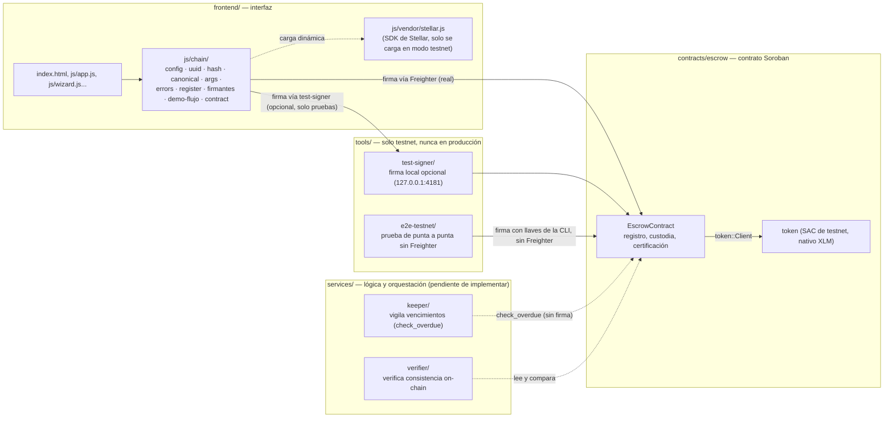

<div align="center">

# 🏗️ INN-LOCK

**Tu cuota inicial solo se mueve cuando la obra avanza**


[**Ver la página publicada**](https://viviendastellar.github.io/Proyecto_Vivienda_Stellar/)

</div>

<br>

## 1. Descripción general

INN-LOCK es un sistema de **custodia de fondos por hitos de obra** para la compra de vivienda sobre planos. El problema que resuelve: hoy un comprador entrega su cuota inicial a la constructora sin ninguna garantía de que ese dinero se use según lo pactado, y no tiene forma de comprobar, de manera independiente, que la obra avanzó antes de que se libere cada desembolso.

INN-LOCK retiene el dinero en un contrato inteligente (`contracts/escrow`) en la red Stellar y solo lo libera hito por hito, cuando **tres roles distintos** están de acuerdo: la constructora reporta el avance con evidencia, un interventor independiente lo certifica, y un administrador/fiduciaria gestiona el registro del proyecto, el cumplimiento legal y los depósitos. Nadie puede mover el dinero solo: cada operación sensible exige la firma criptográfica del rol correspondiente, verificada por la red, no por la aplicación.

Es para:
- **Constructoras** que quieren demostrarle a sus compradores que el dinero está protegido.
- **Interventores** que certifican el avance de obra de forma independiente y verificable.
- **Administradores/fiduciarias** que gestionan el cumplimiento legal y el flujo de fondos.
- **Compradores**, que pueden ver en todo momento cuánto aportaron, cuánto sigue retenido y qué evidencia justificó cada salida.

<br>

## 2. Arquitectura



- **Contrato Soroban** (`contracts/escrow`): la única fuente de verdad sobre el estado de cada proyecto, hito y saldo. Está escrito en Rust (`#![no_std]`), compila a WASM y corre en la red Stellar (testnet). No guarda llaves de nadie: cada función sensible exige `require_auth()` del rol correspondiente.
- **Frontend estático** (`frontend/`): HTML/CSS/JS sin framework ni build step, autocontenido (sin CDN). Tiene dos modos independientes:
  - **Real vs. Demostración** (`?demo=1`): real inicia sesión contra Supabase; demostración usa datos de ejemplo en el navegador.
  - **Simulado vs. Testnet** (`?chain=testnet`): simulado (por defecto) no toca la red; testnet lee y firma contra el contrato real.
- **Freighter**: la extensión de wallet del navegador. Es el único proveedor de firma "real": el frontend nunca ve ni maneja una llave secreta, todo pasa por `window.freighterApi` y la persona aprueba cada firma a mano.
- **`tools/test-signer`**: un servicio HTTP local (127.0.0.1:4181), **solo para pruebas en testnet/localhost**, que firma con las llaves de `inn-constructora`/`inn-interventor`/`inn-admin` obtenidas de la CLI de Stellar al arrancar. Sirve para no tener que cambiar de cuenta en Freighter en cada prueba manual. Reconstruye cada invocación desde el XDR real y solo firma `register_project` sobre el contrato de `deployments/testnet.json` — nunca confía en lo que le mande el frontend.
- **`tools/e2e-testnet`**: una prueba automatizada de punta a punta contra testnet real, sin Freighter ni `test-signer`, pensada para CI/verificación rápida.

<br>

## 3. Flujo del contrato, paso a paso

Todas las funciones viven en `contracts/escrow/contracts/escrow/src/lib.rs`. Los estados de un hito son: `Pendiente → EnCurso → Reportado → (Observado → Reportado)* → Certificado/Desembolsado`.

### 3.1 `register_project` — registrar el proyecto

| | |
|---|---|
| **Firma** | Constructora **+** interventor **+** administrador (las 3, en la misma invocación) |
| **Rechaza si** | el `project_id` ya existe (`YaRegistrado`) · presupuesto ≤ 0 (`PresupuestoInvalido`) · menos de 6 o más de 60 hitos (`CantidadHitosInvalida`) · un hito supera el tope `max(1500, 20000/cantidad_hitos)` puntos base (`HitoExcedeTope`) · la primera fecha límite no es posterior a ahora (`FechaPasada`) · las fechas no son estrictamente crecientes (`FechasNoCrecientes`) · los porcentajes no suman exactamente 10000 bps / 100 % (`SumaPorcentajesInvalida`) |
| **Resultado** | Crea el `Project` (`activo = true`, `congelado = false`), fija `compliance = true`, y crea cada `Milestone`: el hito 0 nace `EnCurso`, el resto `Pendiente`, cada uno con su `cumulative_bps` precalculado. El cronograma queda bloqueado — no se puede volver a registrar el mismo `project_id`. |

### 3.2 `deposit` — depósito de fondos

| | |
|---|---|
| **Firma** | **Administrador** únicamente. La compradora **no firma** esta operación — el comentario del código es explícito: *"la fiduciaria confirma que el dinero llegó"*. |
| **Rechaza si** | el proyecto no existe (`ProyectoNoExiste`) · el monto es ≤ 0 (`MontoInvalido`) |
| **Resultado** | Transfiere `amount` del token del proyecto desde el administrador hacia el contrato, suma el saldo en custodia (`EscrowBalance`) y el aporte acumulado de esa compra (`Contribution`, identificada por `purchase_id`). Funciona **aunque el proyecto esté congelado** (que entre dinero no es un riesgo). |

### 3.3 `report_milestone` — reporte de avance de un hito

| | |
|---|---|
| **Firma** | **Constructora** |
| **Condiciones** | el hito debe estar `EnCurso` u `Observado` (`HitoNoEnCurso` en cualquier otro caso) · al menos 3 fotos (`MIN_FOTOS`, `FotosInsuficientes`) · el `evidence_hash` no puede ser todo ceros (`EvidenciaVacia`) |
| **Resultado** | El hito pasa a `Reportado`, guarda el `Report` (hash de evidencia, cantidad de fotos, momento del reporte) y emite el evento `MilestoneReported`. Se puede reportar después de la fecha límite (queda constancia del atraso más adelante, al certificar). |

### 3.4 Observación o certificación por el interventor

**`observe_milestone`** (rechaza el reporte):

| | |
|---|---|
| **Firma** | **Interventor** |
| **Condiciones** | el hito debe estar `Reportado` (`HitoNoReportado` si no) |
| **Resultado** | El hito pasa a `Observado`; la constructora debe corregir y volver a reportar (`report_milestone` acepta hitos `Observado`). Emite `MilestoneObserved`. |

**`certify_milestone`** (aprueba y libera fondos):

| | |
|---|---|
| **Firma** | **Interventor** |
| **Condiciones** | proyecto no congelado (`ProyectoCongelado`) · `compliance = true` (`DocumentosVencidos`) · el hito debe estar `Reportado` (`HitoNoReportado`) · el `evidence_hash` que se pasa debe coincidir con el que reportó la constructora (`HashNoCoincide`) |
| **Resultado** | Calcula el monto exacto del hito (reparto proporcional sin perder centavos, aritmética verificada) y paga `min(monto, saldo_en_custodia)`. Si alcanza para todo, el hito queda `Desembolsado`; si no, queda `Certificado` con un `pending` que se cobra después con `claim_pending`. Abre el siguiente hito (`Pendiente → EnCurso`) en el mismo momento, sin esperar a que el pago esté completo. Si era el último hito y quedó `Desembolsado`, cierra el proyecto (`activo = false`, evento `ProjectFinished`). Registra si fue tarde y cuántos segundos de atraso. Emite `MilestoneCertified` y `Disbursed`. |

### 3.5 `claim_pending` — cobro de la constructora

| | |
|---|---|
| **Firma** | **Constructora** |
| **Condiciones** | proyecto no congelado · `compliance = true` · el hito debe estar `Certificado` con `pending > 0` (`HitoSinPendiente` en cualquier otro caso) |
| **Resultado** | Paga `min(pending, saldo_en_custodia)`. Si el pendiente llega a 0, el hito pasa a `Desembolsado` (y cierra el proyecto si era el último). Emite `Disbursed`. |

### 3.6 Cambios de cronograma

**`request_schedule_change`** (propone el cambio):

| | |
|---|---|
| **Firma** | **Constructora** |
| **Condiciones** | solo una solicitud pendiente a la vez (`SolicitudPendiente`) · cada hito tocado debe existir y estar `Pendiente` (`HitoNoModificable`) · índices no repetidos (`IndiceRepetido`) · respeta el mismo tope por hito · las nuevas fechas son posteriores a ahora · el porcentaje total de los hitos tocados debe conservarse exactamente (`TotalNoConservado`) · el cronograma completo (con los cambios aplicados en memoria) debe seguir con fechas estrictamente crecientes (`FechasNoCrecientes`) |
| **Resultado** | Guarda la `ScheduleChangeRequest` (ítems, motivo, nuevo hash de cronograma) y emite `ScheduleChangeRequested`. |

**`resolve_schedule_change`** (la resuelve):

| | |
|---|---|
| **Firma** | **Interventor** |
| **Condiciones** | debe existir una solicitud pendiente (`SinSolicitud`) |
| **Resultado** | Si **aprueba**: aplica los cambios a cada hito, recalcula el `cumulative_bps` de todos los hitos (un cambio desplaza a los que siguen) y actualiza `hash_cronograma` del proyecto; emite `ScheduleChanged`. Si **rechaza**: no cambia nada, emite `ScheduleChangeRejected`. En ambos casos borra la solicitud pendiente. |

### 3.7 Congelar, descongelar y marcar vencidos

| Función | Firma | Qué hace |
|---|---|---|
| `freeze` | Administrador | `congelado = true`. Bloquea `certify_milestone` y `claim_pending`; **no** bloquea `deposit`, `report_milestone` ni `observe_milestone`. Rechaza si ya estaba congelado (`YaCongelado`). Guarda el motivo y emite `ProjectFrozen`. |
| `unfreeze` | Administrador | `congelado = false`. Rechaza si no estaba congelado (`NoCongelado`). Marca `unfrozen_at` en el historial y emite `ProjectUnfrozen`. |
| `check_overdue` | **Nadie** (sin `require_auth`) | Cualquiera puede llamarla. Solo aplica a un hito `EnCurso`, `Reportado` u `Observado` (`HitoNoVencible`); exige que ya haya pasado la fecha límite (`AunNoVence`) y que no se haya marcado antes (`YaMarcadoVencido`). No cambia el estado del hito ni mueve dinero: solo deja un registro auditable (`Overdue`) y emite `MilestoneOverdue`. Es la función que usaría el servicio `services/keeper/` (pendiente de implementar). |

### 3.8 `set_compliance`

| | |
|---|---|
| **Firma** | **Administrador** |
| **Resultado** | Fija si la constructora tiene su documentación legal vigente (`true`/`false`). Al registrar el proyecto empieza en `true`; si el administrador detecta un documento vencido, lo pasa a `false`, lo que bloquea de inmediato `certify_milestone` y `claim_pending` hasta que vuelva a `true`. |

<br>

## 4. Tabla de roles y firmas

Nombres exactos tal como aparecen en el código (`lib.rs`, `register.js`, `test-signer/lib/claves.js`):

| Rol en el contrato | Firma (`require_auth`) en | No firma |
|---|---|---|
| **`constructora`** | `register_project` (junto con interventor y administrador), `report_milestone`, `request_schedule_change`, `claim_pending` | `deposit`, `certify_milestone`, `observe_milestone`, `freeze`/`unfreeze`, `resolve_schedule_change`, `set_compliance` |
| **`interventor`** | `register_project` (junto con constructora y administrador), `certify_milestone`, `observe_milestone`, `resolve_schedule_change` | `deposit`, `report_milestone`, `freeze`/`unfreeze`, `claim_pending`, `set_compliance` |
| **`administrador`** | `register_project` (junto con constructora e interventor), `deposit`, `set_compliance`, `freeze`, `unfreeze` | `report_milestone`, `certify_milestone`, `observe_milestone`, `request_schedule_change`/`resolve_schedule_change`, `claim_pending` |
| **`check_overdue`** | — sin firma, cualquiera puede llamarla | — |

El contrato **no tiene un rol `comprador`**: la persona que compra aporta dinero, pero quien firma `deposit` es el administrador/fiduciaria (confirma que el pago llegó). El comprador participa solo como lector (`get_balance`, `get_contribution`, etc.), nunca como firmante on-chain en este contrato.

Identidades de prueba en testnet (direcciones públicas, `contracts/escrow/deployments/testnet.json`):

| Rol | Identidad CLI (`stellar keys ls`) | Dirección |
|---|---|---|
| Constructora | `inn-constructora` | `GCYQDJ6UO3EHEL4GXLVMGTVTJEOV3OTWDJQPGSFTHPS2BCLRLT4OYRJS` |
| Interventor | `inn-interventor` | `GAGEYZHS5LQPGQSK5YNQBCR6RKUJLSPO7ET4K76UJXZJUH6QZZ5PWEIW` |
| Administrador | `inn-admin` | `GBP3BRO5XE3EG7YVSE74OQVFCK4XCOOCWCGXHTFEBTBLZCQ576EVMI7M` |

> **Limitación del piloto**: en el frontend de demostración, estas 3 direcciones son compartidas por todos los proyectos (`frontend/js/config.js`, `testRoles`) — no hay todavía una dirección distinta por cada constructora/interventor real. Direcciones por usuario llegan con una migración de base de datos futura.

<br>

## 5. Dónde firma cada rol en la interfaz

Del código real de `frontend/js/wizard.js`, `frontend/js/chain/demo-flujo.js` y `frontend/js/chain/firmantes.js`. **Solo `register_project` está conectado a la cadena desde el frontend** (ver sección 9); el resto de funciones del contrato (`deposit`, `report_milestone`, `certify_milestone`, etc.) todavía se simulan con datos locales en la demostración.

Esto solo ocurre en **modo testnet** (`?chain=testnet` en la URL); en modo simulado (el predeterminado) no aparece ninguna de estas casillas ni pantallas on-chain — `window.ChainDemo.disponible()` devuelve `false` y todo el código de firma se omite.

| Rol | Pantalla / ruta | Botón | Proveedor de firma |
|---|---|---|---|
| **Constructora** | "Registrar proyecto" (`#/nuevo`), paso 4 "Resumen y envío" | `Enviar a interventoría` (o `Reenviar a interventoría` si edita) | Freighter, o 🧪 el servicio de pruebas si la casilla está marcada |
| **Interventor** | "Solicitudes" (`#/solicitudes`), tarjeta del proyecto → modal "Aprobar cronograma" | `Aprobar y firmar` | Freighter, o 🧪 el servicio de pruebas |
| **Administrador** | "Solicitudes" (`#/solicitudes`), tarjeta del proyecto → modal "Validar y activar" | `Activar proyecto` | Freighter, o 🧪 el servicio de pruebas (firma y envía la transacción) |

Cada una de esas pantallas, en modo testnet, muestra una casilla **"🧪 Firmar con el servicio de pruebas"** (`toggleFirmaPruebaHtml()` en `wizard.js`) que, si está marcada y `tools/test-signer` está corriendo, usa ese servicio en vez de abrir Freighter — útil para no cambiar de cuenta en la extensión en cada prueba manual.

Además:
- Si una firma de la constructora o el interventor caduca antes de que termine el flujo, aparece un botón **"Firmar de nuevo"** que solo repite esa firma (`chainRefirmar` en `wizard.js`).
- El estado on-chain se muestra junto al proyecto en "Solicitudes" y en su ficha: insignia "Firmado 1/3" → "2/3" → "Activo en cadena", con enlace a Stellar Expert.
- **`frontend/testnet-registro.html`**: una página de prueba aislada, con las mismas 3 etapas pero sin el resto de la app — útil para depurar la mecánica de las 3 firmas sin iniciar sesión ni navegar la demo.

<br>

## 6. Cómo ejecutar el demo

### 6.1 Requisitos

| Herramienta | Para qué | Confirmado en |
|---|---|---|
| **Git** | Clonar el repositorio | — |
| **Rust + el target `wasm32v1-none`** (Rust 1.84 o más nuevo; 1.82/1.83 no compilan) | Compilar el contrato | `contracts/escrow/AGENTS.md` |
| **Stellar CLI** (`stellar`) | Compilar, probar, desplegar el contrato y obtener llaves para `test-signer`/`e2e-testnet` | `contracts/escrow/AGENTS.md`, `tools/test-signer/lib/claves.js` |
| **Python 3** | Servir el frontend estático | `frontend/README.md` |
| **Node.js 18+** | Correr `tools/e2e-testnet` y `tools/test-signer` (usan `fetch` nativo) | `tools/e2e-testnet/package.json`, `tools/test-signer/package.json` |
| **Freighter** (extensión de navegador), configurada en **Testnet** | Firmar de verdad desde la interfaz | `frontend/js/chain/freighter.js` |
| Un navegador (Chrome, Edge o Firefox) | Abrir la página | `frontend/README.md` |

No hace falta instalar ninguna librería de JavaScript para el frontend: no usa CDN ni empaquetador (por confirmar si se agregan dependencias nuevas más adelante).

### 6.2 Clonar

```bash
git clone https://github.com/ViviendaStellar/Proyecto_Vivienda_Stellar.git
cd Proyecto_Vivienda_Stellar
```

### 6.3 Compilar y probar el contrato

El workspace de Cargo vive en `contracts/escrow/` (no en la raíz del repositorio):

```bash
cd contracts/escrow
rustup target add wasm32v1-none   # una sola vez
stellar contract build            # compila a target/wasm32v1-none/release/escrow.wasm
cargo test                        # corre los tests de contracts/escrow/contracts/escrow/src/test.rs
```

El contrato **ya está desplegado en testnet** (ver sección 7); no hace falta volver a desplegarlo para correr el demo. Si quisieras hacerlo de nuevo (por ejemplo tras un cambio), el patrón es (por confirmar el alias/identidad exactos que usarías tú):

```bash
stellar contract deploy \
  --wasm target/wasm32v1-none/release/escrow.wasm \
  --source-account <tu-identidad> \
  --network testnet \
  --alias escrow
```

### 6.4 Levantar el frontend

```bash
cd frontend
python -m http.server 4180
# en Windows, si "python" no funciona: py -m http.server 4180
```

| Modo | URL | Qué hace |
|---|---|---|
| Real | `http://localhost:4180` | Inicio de sesión con Supabase |
| Demostración | `http://localhost:4180/?demo=1` | Datos de ejemplo en el navegador, 4 perfiles con contraseña `demo1234` (`admin@inn-lock.co`, `comprador@inn-lock.co`, `constructora@inn-lock.co`, `interventor@inn-lock.co`) |
| Demostración + testnet | `http://localhost:4180/?demo=1&chain=testnet` (o agrega `?chain=testnet` después, queda guardado en el navegador) | Igual que demostración, pero las 3 firmas de `register_project` van contra el contrato real |

### 6.5 (Opcional) Levantar el servicio de firma de pruebas

Para no tener que cambiar de cuenta en Freighter en cada prueba manual de los 3 roles:

```bash
cd tools/test-signer
INNLOCK_TEST_SIGNER=1 node server.js
```

Escucha en `http://127.0.0.1:4181`. Exige que existan las identidades `inn-constructora`, `inn-interventor` e `inn-admin` en tu CLI de Stellar (`stellar keys ls`) y que la red configurada sea exactamente testnet; si no, se niega a arrancar. En la interfaz, marca la casilla 🧪 antes de firmar cada paso.

### 6.6 Probar el flujo de las 3 firmas en la interfaz

1. Entra como **Constructora** (`constructora@inn-lock.co` / `demo1234`), ve a "Registrar proyecto", completa el asistente (o usa "Rellenar con datos de ejemplo") y en el paso 4 haz clic en "Enviar a interventoría".
2. Entra como **Interventor** (`interventor@inn-lock.co`), ve a "Solicitudes" y haz clic en "Aprobar cronograma" → "Aprobar y firmar".
3. Entra como **Administrador** (`admin@inn-lock.co`), ve a "Solicitudes" y haz clic en "Validar y activar" → "Activar proyecto". Este paso firma, envía la transacción real a testnet y la confirma.
4. Verifica el resultado: la ficha del proyecto muestra "Activo en cadena" con un enlace a Stellar Expert; o corre el script de verificación (sección 6.8).

### 6.7 Alternativa automatizada (sin interfaz, sin Freighter)

```bash
./e2e-testnet.sh
# equivale a: cd tools/e2e-testnet && node run.js
```

Qué hace (`tools/e2e-testnet/run.js`): construye un proyecto de muestra (`lib/proyecto-muestra.js`: `project_id` nuevo con `crypto.randomUUID()` en cada corrida, presupuesto `1000000` en unidades del token de prueba, 6 hitos con porcentajes `[17 %, 17 %, 17 %, 17 %, 17 %, 15 %]` y fechas futuras espaciadas 30 días), firma constructora → interventor → administrador cada uno por separado con su propia llave (obtenida de la CLI), el administrador firma último y envía, y al final relee `get_project` y compara. También corre 5 casos negativos: cuenta equivocada, cronograma modificado después de firmar, firma caducada (con una ventana de prueba de ~10s en vez de los 7 días normales), registrar el mismo proyecto dos veces, y una suma de porcentajes distinta de 10000. Requiere las mismas 3 identidades CLI que `test-signer`, con `inn-admin` fondeada (paga la tarifa de la transacción final).

### 6.8 Verificar lo que quedó en testnet

```bash
node docs/semana3/verificar-registro.js estado.json
```

`estado.json` se exporta desde el panel de depuración de `testnet-registro.html` ("Estado guardado" → "Mostrar"). El script relee `get_project` y `get_milestone(0)` del contrato (sin firmar nada) y compara cada campo contra lo que se guardó al firmar.

<br>

## 7. Contrato desplegado

De `contracts/escrow/deployments/testnet.json`:

| Campo | Valor |
|---|---|
| Red | `testnet` |
| Network passphrase | `Test SDF Network ; September 2015` |
| ID del contrato escrow | `CBS57WMMUYBWCLFGEKOZYWPRAHHBFP432AJ57P5HFWK6DD7GRI5WJOBT` |
| ID del contrato del token | `CDLZFC3SYJYDZT7K67VZ75HPJVIEUVNIXF47ZG2FB2RMQQVU2HHGCYSC` (SAC del activo nativo, `token_asset: "native"`) |
| Hash del Wasm | `0e4c459b058e8f5359decb6b65cac210c6aee589eefc337f0c6068a3eba5a957` |
| Desplegado | `2026-10-09T15:11:20Z`, con la cuenta `inn-admin` |

Explorador: [stellar.expert/explorer/testnet/contract/CBS57WMMUYBWCLFGEKOZYWPRAHHBFP432AJ57P5HFWK6DD7GRI5WJOBT](https://stellar.expert/explorer/testnet/contract/CBS57WMMUYBWCLFGEKOZYWPRAHHBFP432AJ57P5HFWK6DD7GRI5WJOBT)

<br>

## 8. Estructura del repositorio

```text
.
├── contracts/
│   └── escrow/                      # workspace de Cargo (no la raíz del repo)
│       ├── Cargo.toml                # [workspace], soroban-sdk = "28"
│       ├── AGENTS.md                 # comandos de build/test/deploy confirmados
│       ├── deployments/testnet.json  # contrato ya desplegado, direcciones de prueba
│       └── contracts/escrow/
│           ├── src/lib.rs            # el contrato (ver secciones 3-4)
│           ├── src/test.rs           # tests con mock_auths / mock_all_auths
│           └── test_snapshots/       # snapshots de cada test (contexto on-chain)
├── frontend/                        # app estática (sin build step, sin CDN)
│   ├── index.html
│   ├── testnet-registro.html         # página de prueba aislada de las 3 firmas
│   ├── js/
│   │   ├── app.js, wizard.js, schedule.js, data.js, ui.js...  # app de demostración
│   │   └── chain/                    # capa on-chain
│   │       ├── config.js             # resuelve modo simulado/testnet, carga el SDK
│   │       ├── freighter.js          # conexión de solo lectura con Freighter
│   │       ├── register.js           # orquesta las 3 firmas de register_project
│   │       ├── firmantes.js          # proveedor Freighter vs. proveedor test-signer
│   │       ├── demo-flujo.js         # puente entre wizard.js y register.js
│   │       ├── contract.js           # cliente de solo lectura (get_project, etc.)
│   │       ├── args.js, canonical.js, hash.js, uuid.js, errors.js
│   │       └── __tests__/run.js      # pruebas unitarias (hash, args, caducidad)
│   └── supabase/                     # modo real (ver frontend/supabase/README.md)
├── services/                         # capa de orquestación — solo documentada, sin código
│   ├── keeper/README.md              # llamaría check_overdue (pendiente)
│   └── verifier/README.md            # verificaría consistencia on-chain (pendiente)
├── tools/
│   ├── e2e-testnet/                  # prueba automatizada de punta a punta
│   │   ├── run.js                    # flujo feliz + 5 casos negativos
│   │   └── lib/                      # sdk, claves (CLI), seguridad, firma, proyecto-muestra
│   ├── test-signer/                  # servicio local de firma (solo pruebas)
│   │   ├── server.js                 # HTTP en 127.0.0.1:4181
│   │   └── lib/lista-blanca.js       # reconstruye y valida la invocación desde el XDR
│   └── vendor-build/                 # empaqueta @stellar/stellar-sdk y freighter-api
│       └── build.mjs                 # genera frontend/js/vendor/stellar.js
├── docs/
│   └── semana3/
│       ├── ARQUITECTURA_ONCHAIN.md   # diagrama de capas y detalle de las 3 firmas
│       ├── GUIA_FIRMAS_TESTNET.md    # guía manual paso a paso con Freighter
│       └── verificar-registro.js     # lee get_project y compara contra lo firmado
├── e2e-testnet.sh                    # atajo: cd tools/e2e-testnet && node run.js
└── .github/workflows/pages.yml       # publica frontend/ en GitHub Pages al hacer push a main
```

<br>

## 9. Problemas conocidos y limitaciones

- **Solo `register_project` está conectado a la cadena desde el frontend.** El resto de funciones del contrato (`deposit`, `report_milestone`, `certify_milestone`, `observe_milestone`, `freeze`/`unfreeze`, cambios de cronograma, `claim_pending`) existen y están probadas en el contrato (`src/test.rs`), pero en la interfaz de demostración todavía se simulan con datos locales (`js/data.js`), no con transacciones reales. Así lo dice el propio `frontend/README.md`: *"Pendiente para la fase blockchain: reemplazar... los registros simulados... por transacciones reales Stellar/Soroban"*.
- **`services/keeper/` y `services/verifier/` no tienen código todavía** — son carpetas con su rol documentado (`services/README.md`, cada `services/<nombre>/README.md` dice explícitamente *"Pendiente de implementar (fuera de este paso)"*).
- **Las 3 direcciones de prueba son compartidas**, no una por constructora/interventor real (`frontend/js/config.js`, `testRoles`); una dirección por usuario llega con una migración de base de datos futura (ver `docs/semana3/ARQUITECTURA_ONCHAIN.md`).
- **El presupuesto no tiene una conversión real a stroops/moneda**: el frontend usa el número que captura el asistente directamente como unidades del token de prueba. El token de testnet (SAC del activo nativo) no representa dinero real.
- **El guardado del registro confirmado en la base de datos real (Supabase)** está fuera de alcance de este paso — el flujo on-chain solo corre en modo demostración + testnet, nunca toca `ctx.LIVE`.
- **No hay un tope duro documentado del protocolo** para `signatureExpirationLedger` (la ventana de vigencia de una firma); `register.js` usa 7 días para constructora/interventor y ~5 minutos para el administrador como una elección razonable, no como un límite garantizado por la red (ver `docs/semana3/ARQUITECTURA_ONCHAIN.md`).
- El techo real de TTL de almacenamiento en testnet se confirmó en 180 días (`max_entry_ttl` = 3.110.400 ledgers, protocolo 29); el contrato extiende hasta 120 días cada vez (`TTL_EXTENDER_LEDGERS` en `lib.rs`), dejando margen por debajo de ese techo.
- `tools/test-signer` y `tools/e2e-testnet` están explícitamente marcados como herramientas de **solo testnet/localhost** — no deben usarse ni adaptarse para producción (manejan secretos solo en memoria, nunca los imprimen ni los escriben a disco).

<br>

## 🔗 Modos de cadena (resumen)

Además del modo real/demostración, la página tiene dos modos de **cadena**, independientes de ese: **simulado** (predeterminado, no toca la red) y **testnet** (lee y firma contra el contrato real). Se activa con `?chain=testnet` en la URL y se recuerda en el navegador. Detalle completo: [`docs/semana3/ARQUITECTURA_ONCHAIN.md`](docs/semana3/ARQUITECTURA_ONCHAIN.md) y [`docs/semana3/GUIA_FIRMAS_TESTNET.md`](docs/semana3/GUIA_FIRMAS_TESTNET.md).

<br>

## Archivos leídos para este README

`contracts/escrow/contracts/escrow/src/lib.rs` · `contracts/escrow/contracts/escrow/src/test.rs` (primeras ~1470 líneas de 2123; el resto son más tests del mismo tipo — congelamiento, cambios de cronograma — cuyos nombres se confirmaron en `test_snapshots/`) · `contracts/escrow/README.md` (genérico, de la plantilla de Soroban, sin información específica de este proyecto) · `contracts/escrow/AGENTS.md` · `contracts/escrow/deployments/testnet.json` · `contracts/escrow/Cargo.toml` · `contracts/escrow/contracts/escrow/Cargo.toml` · `frontend/README.md` · `frontend/js/chain/demo-flujo.js` · `frontend/js/chain/firmantes.js` · `frontend/js/chain/config.js` · `frontend/js/chain/freighter.js` · `frontend/js/wizard.js` · `frontend/js/schedule.js` (primeras 80 líneas) · `frontend/testnet-registro.html` (estructura, no el archivo completo) · `frontend/js/app.js` (rutas `ALLOWED`) · `tools/test-signer/server.js` · `tools/test-signer/lib/lista-blanca.js` (ya conocido de esta misma sesión) · `tools/e2e-testnet/run.js` y `tools/e2e-testnet/lib/*.js` · `e2e-testnet.sh` · `docs/semana3/GUIA_FIRMAS_TESTNET.md` · `docs/semana3/ARQUITECTURA_ONCHAIN.md` · `.github/workflows/pages.yml` · `services/README.md`, `services/keeper/README.md`, `services/verifier/README.md`.

**Inconsistencias encontradas entre documentación y código:**
- `contracts/escrow/README.md` es la plantilla genérica que deja `stellar init`/`soroban init` (menciona un contrato `hello_world` que no existe en este repositorio) — no documenta nada específico de `escrow`. La información real del contrato está en el propio `lib.rs` y en `AGENTS.md`.
- `frontend/README.md` describe el modo de cadena simulado/testnet como si solo sirviera para **lectura** ("Firmar... se añade en el Paso 8"); el código actual (`register.js`, `demo-flujo.js`, `firmantes.js`) ya firma y envía `register_project` de verdad — ese README quedó desactualizado respecto al estado real del código, aunque `docs/semana3/ARQUITECTURA_ONCHAIN.md` sí está al día.
- El comando de `stellar contract deploy` en la sección 6.3 es el patrón genérico de `AGENTS.md`, no el comando exacto que se usó para el despliegue real que aparece en `deployments/testnet.json` (ese registro solo guarda el resultado, no el comando) — por eso se marca "por confirmar".
