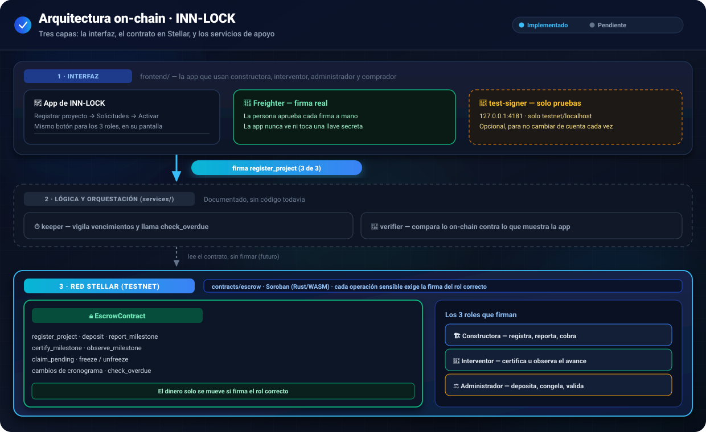

<div align="center">

# 🏗️ INN-LOCK

**Tu cuota inicial solo se mueve cuando la obra avanza**


[**Ver la página publicada**](https://viviendastellar.github.io/Proyecto_Vivienda_Stellar/)

</div>

<br>

## 1. Descripción general

Cuando alguien compra vivienda sobre planos, entrega su cuota inicial a la constructora sin ninguna garantía: no sabe si ese dinero se usa como se pactó, ni tiene forma de comprobar que la obra realmente avanzó antes de que se suelte el siguiente pago.

**INN-LOCK resuelve esto reteniendo el dinero en un contrato inteligente**, no en la cuenta de la constructora. El contrato solo libera cada pago cuando tres personas distintas están de acuerdo: la constructora reporta el avance con evidencia, un interventor independiente lo certifica, y un administrador/fiduciaria gestiona el proyecto y los depósitos. Nadie puede mover el dinero por su cuenta — cada paso sensible exige una firma digital que la red Stellar verifica, no la aplicación.

**¿Para quién es?**

| Rol | Qué gana con INN-LOCK |
|---|---|
| 🏗️ **Constructora** | Demuestra a sus compradores, con pruebas verificables, que el dinero está protegido |
| 🦺 **Interventor** | Certifica el avance de obra de forma independiente, con su propia firma |
| ⚖️ **Administrador / fiduciaria** | Gestiona el cumplimiento legal y el flujo de fondos, sin perder el control |
| 🏠 **Comprador** | Ve en todo momento cuánto aportó, cuánto sigue retenido y qué evidencia justificó cada salida |

<br>

### 📖 Palabras que vas a ver en este documento

Este README mezcla explicación simple con detalle técnico exacto (nombres de funciones, códigos de error). Si no eres programador, estas son las palabras que más se repiten:

| Palabra | Qué significa, en simple |
|---|---|
| **Contrato inteligente** | Un programa que vive en internet (en la red Stellar) y que nadie puede modificar ni apagar a su antojo. Guarda reglas fijas: "el dinero solo sale si pasa X e Y". |
| **Firmar / firma digital** | El equivalente a poner tu huella o tu firma en un papel, pero con criptografía: prueba, sin dejar lugar a dudas, que fuiste tú (y no otra persona) quien aprobó algo. |
| **Stellar / testnet** | Stellar es la red donde vive el contrato. "Testnet" es su versión de pruebas: el dinero que se mueve ahí no es real, sirve para probar que todo funciona antes de usar dinero de verdad. |
| **Hito** | Una etapa de la obra (por ejemplo, "cimentación" o "estructura"). El presupuesto se reparte en hitos, y el dinero de cada uno se libera por separado. |
| **Hash** | Una "huella digital" de un archivo o de un texto: si el archivo cambia aunque sea una letra, el hash cambia por completo. Sirve para comprobar que nadie alteró la evidencia o el cronograma después de firmarlo. |
| **Freighter** | La "billetera" (una extensión del navegador) donde cada persona guarda su propia llave y aprueba sus propias firmas. La aplicación nunca ve esa llave. |
| **Wallet / cuenta / dirección** | Tu identidad en la red Stellar — algo parecido a un número de cuenta bancaria, pero público y verificable por cualquiera. |
| **bps / puntos base** | Una forma más precisa de escribir porcentajes: 1 % = 100 bps, y 100 % = 10000 bps. Se usa para repartir el presupuesto sin perder centavos en los redondeos. |
| **TTL** | "Tiempo de vida" de un dato guardado en la red: cada tanto hay que "renovarlo" o la red lo archiva. El contrato lo hace solo, automáticamente. |
| **WASM** | El formato en el que queda compilado el contrato para poder correr en la red — como un .exe, pero para blockchains. |

<br>

## 2. Arquitectura

La solución tiene tres capas, de arriba hacia abajo: la **interfaz** donde cada rol firma, la **lógica de apoyo** (todavía por construir) y el **contrato en Stellar**, que es la única fuente de verdad.

<p align="center">
  
</p>

En palabras simples:

1. **La interfaz** (`frontend/`) es donde constructora, interventor y administrador hacen clic para firmar. Puede firmar de dos formas: con **Freighter** (la extensión de wallet real, donde cada persona aprueba su propia firma) o, solo para pruebas, con el servicio local **`test-signer`**.
2. **La lógica de apoyo** (`services/`) todavía no tiene código — está documentada para vigilar vencimientos y verificar que todo cuadre, pero por ahora el contrato funciona sin ella.
3. **El contrato** (`contracts/escrow`) vive en la red Stellar (testnet). Está escrito en Rust, corre como WebAssembly, y es quien de verdad decide si una operación es válida: cada función sensible exige la firma del rol correcto antes de ejecutarse.

Tres cosas más que vale la pena saber:
- El frontend **nunca toca una llave secreta**. Firmar siempre pasa por Freighter (o, solo en pruebas, por `test-signer`, que guarda las llaves en memoria y nunca las expone).
- Dos interruptores independientes controlan el modo de la app: **real vs. demostración** (`?demo=1`, datos de ejemplo sin base de datos) y **simulado vs. testnet** (`?chain=testnet`, habla de verdad con la red).
- `tools/e2e-testnet` es una prueba automatizada que repite todo el flujo contra testnet real, sin Freighter, pensada para verificar rápido que nada se rompió.

<br>

## 3. Flujo del contrato, paso a paso

En resumen: la constructora **reporta** avance con fotos, el interventor lo **certifica** (o lo rechaza), y solo al certificar se **libera el dinero**. Cada función de abajo es un paso de ese ciclo, repetido una vez por cada hito del cronograma. Todas viven en `contracts/escrow/contracts/escrow/src/lib.rs`. Un hito recorre estos estados:

<p align="center">
<code>Pendiente</code> → <code>EnCurso</code> → <code>Reportado</code> → ( <code>Observado</code> → <code>Reportado</code> )* → <code>Certificado</code> / <code>Desembolsado</code>
</p>

> 🏗️ constructora · 🦺 interventor · ⚖️ administrador · 🌐 nadie (pública, sin firma)

<br>

### 🏗️🦺⚖️ 3.1 `register_project` — registrar el proyecto

> 💬 **En simple:** así nace el proyecto en la red. Los 3 roles se ponen de acuerdo de una sola vez sobre el presupuesto y el cronograma, y a partir de ahí esas reglas quedan fijas — nadie las puede cambiar en secreto después.

> **Firma:** constructora **+** interventor **+** administrador, los 3 en la misma invocación.

**❌ No se deja registrar si:**
- Ese proyecto ya se había registrado antes — no se puede duplicar (`YaRegistrado`)
- El presupuesto es cero o negativo (`PresupuestoInvalido`)
- El cronograma tiene menos de 6 hitos o más de 60 (`CantidadHitosInvalida`)
- Un solo hito concentra demasiado del presupuesto — entre más hitos tenga el cronograma, más bajo es el tope por hito (`HitoExcedeTope`)
- La fecha límite del primer hito ya pasó, o no es una fecha futura (`FechaPasada`)
- Las fechas de los hitos no van en orden, una tras otra (`FechasNoCrecientes`)
- Los porcentajes de todos los hitos, sumados, no dan exactamente 100 % (`SumaPorcentajesInvalida`)

**✅ Si todo está bien:** se crea el proyecto (activo, sin congelar) y cada hito de su cronograma — el primero queda listo para empezar, los demás en espera. A partir de aquí, el cronograma queda bloqueado: ese mismo proyecto no se puede volver a registrar.

---

### ⚖️ 3.2 `deposit` — depósito de fondos

> 💬 **En simple:** cuando el comprador paga, ese dinero no cae en la cuenta de la constructora ni en la del comprador — entra directo al contrato, a quedar "congelado" ahí hasta que se cumplan los hitos.

> **Firma:** administrador únicamente. La compradora **no firma** esta operación — el comentario del código es explícito: *"la fiduciaria confirma que el dinero llegó"*.

**❌ No se deja depositar si:**
- El proyecto no existe (`ProyectoNoExiste`)
- El monto es cero o negativo (`MontoInvalido`)

**✅ Si todo está bien:** el dinero pasa de la cuenta del administrador al contrato, se suma al saldo retenido del proyecto y queda registrado cuánto lleva aportado esa compra puntual. Funciona **aunque el proyecto esté congelado** — que entre dinero nunca es un riesgo.

---

### 🏗️ 3.3 `report_milestone` — reporte de avance de un hito

> 💬 **En simple:** la constructora dice "ya terminé esta etapa" y deja fotos como prueba. Es como subir la evidencia a un buzón que nadie (ni ella misma) puede borrar después.

> **Firma:** constructora.

**❌ No se deja reportar si:**
- El hito no está en curso ni fue observado antes — por ejemplo, ya está certificado, o todavía no le toca empezar (`HitoNoEnCurso`)
- Hay menos de 3 fotos de evidencia (`FotosInsuficientes`)
- La huella (hash) de la evidencia viene vacía (`EvidenciaVacia`)

**✅ Si todo está bien:** el hito pasa a "reportado" y queda guardada la evidencia (su huella, cuántas fotos y cuándo se reportó). Se puede reportar después de la fecha límite — el atraso queda registrado más adelante, cuando se certifique.

---

### 🦺 3.4 Observación o certificación por el interventor

> 💬 **En simple:** el interventor revisa lo que reportó la constructora y decide: "esto no está bien, corrígelo" (observar) o "esto sí avanzó de verdad, suelten el pago" (certificar). Es el filtro independiente que evita que el dinero salga sin que la obra realmente avance.

**`observe_milestone`** — rechaza el reporte y lo devuelve a corregir:

**❌ No se deja observar si:** el hito todavía no fue reportado (`HitoNoReportado`)

**✅ Si todo está bien:** el hito pasa a "observado" y queda esperando a que la constructora corrija y reporte de nuevo.

**`certify_milestone`** — aprueba el hito y libera fondos:

**❌ No se deja certificar si:**
- El proyecto está congelado (`ProyectoCongelado`)
- La constructora tiene documentos legales vencidos (`DocumentosVencidos`)
- El hito no está reportado (`HitoNoReportado`)
- La evidencia que se está certificando no es la misma que reportó la constructora — alguien intentó cambiarla (`HashNoCoincide`)

**✅ Si todo está bien:** se calcula lo que vale ese hito y se paga lo que alcance del dinero que ya está depositado. Si alcanza para todo, el hito queda pagado del todo; si no, queda "certificado" con un saldo pendiente que se cobra más adelante con `claim_pending`. El hito siguiente se abre en ese mismo momento, sin esperar a que el pago quede completo. Si era el último hito del proyecto, el proyecto se cierra ahí mismo.

---

### 🏗️ 3.5 `claim_pending` — cobro de la constructora

> 💬 **En simple:** si cuando se certificó un hito todavía no había suficiente dinero depositado para pagarlo completo, queda un saldo pendiente. En cuanto llega más dinero, la constructora puede venir a cobrar ese resto.

> **Firma:** constructora.

**❌ No se deja cobrar si:**
- El proyecto está congelado
- La constructora tiene documentos legales vencidos
- Ese hito no tiene ningún saldo pendiente por cobrar (`HitoSinPendiente`)

**✅ Si todo está bien:** se paga lo que alcance del saldo pendiente. Si con eso queda todo pagado, el hito pasa a "pagado por completo" (y cierra el proyecto si era el último hito).

---

### 🏗️🦺 3.6 Cambios de cronograma

> 💬 **En simple:** a veces hay que mover una fecha o ajustar un porcentaje del cronograma original. La constructora propone el cambio y el interventor lo aprueba o lo rechaza — nunca lo decide la constructora sola, y el total del presupuesto nunca puede cambiar por esta vía.

**`request_schedule_change`** (🏗️ constructora propone):

**❌ No se deja proponer el cambio si:**
- Ya hay otra solicitud de cambio esperando respuesta (`SolicitudPendiente`)
- Se quiere tocar un hito que ya empezó, o que no existe — solo se pueden mover hitos que todavía no arrancan (`HitoNoModificable`)
- Se repite el mismo hito dos veces en la misma solicitud (`IndiceRepetido`)
- El nuevo porcentaje de algún hito supera el tope permitido
- La nueva fecha propuesta ya pasó
- Sumando los porcentajes de los hitos que se tocan, el total no da lo mismo que antes — no se le puede "quitar" presupuesto a un hito sin dárselo a otro (`TotalNoConservado`)
- El cronograma, ya con los cambios aplicados, deja de tener las fechas en orden (`FechasNoCrecientes`)

**✅ Si todo está bien:** la propuesta queda guardada, esperando que el interventor la apruebe o la rechace.

**`resolve_schedule_change`** (🦺 interventor decide):

**❌ No se deja resolver si:** no hay ninguna solicitud esperando (`SinSolicitud`)

**✅ Si todo está bien:** si el interventor **aprueba**, los cambios se aplican de verdad al cronograma. Si **rechaza**, no cambia nada. En los dos casos, la solicitud se cierra — no queda pendiente para siempre.

---

### ⚖️🌐 3.7 Congelar, descongelar y marcar vencidos

> 💬 **En simple:** "congelar" es un botón de pánico que tiene el administrador — si algo anda mal con el proyecto, puede pausar los pagos sin detener el resto (los reportes y depósitos siguen funcionando). `check_overdue` es distinto: es una alerta pública de "esta etapa ya se atrasó", que cualquiera puede activar, sin mover dinero.

| Función | Firma | Qué hace |
|---|---|---|
| `freeze` | ⚖️ Administrador | `congelado = true`. Bloquea `certify_milestone` y `claim_pending`; **no** bloquea `deposit`, `report_milestone` ni `observe_milestone`. Rechaza si ya estaba congelado (`YaCongelado`). |
| `unfreeze` | ⚖️ Administrador | `congelado = false`. Rechaza si no estaba congelado (`NoCongelado`). |
| `check_overdue` | 🌐 Nadie (sin firma) | Cualquiera puede llamarla. Solo aplica a un hito abierto (`EnCurso`, `Reportado` u `Observado`); exige que ya venció y que no se haya marcado antes. No mueve dinero: solo deja un registro auditable (`Overdue`). Es la función que usaría `services/keeper/` (pendiente de implementar). |

---

### ⚖️ 3.8 `set_compliance`

> 💬 **En simple:** el administrador marca si la constructora tiene sus papeles legales al día. Si no los tiene, el contrato bloquea automáticamente los pagos hasta que se pongan al día — sin que nadie tenga que acordarse de revisarlo a mano cada vez.

> **Firma:** administrador.

**✅ Qué hace:** marca "sí" o "no" a si la constructora tiene sus documentos al día. Empieza en "sí"; si el administrador detecta algo vencido, lo cambia a "no" — y eso bloquea de inmediato las certificaciones y los cobros, hasta que vuelva a estar en "sí".

<br>

## 4. Tabla de roles y firmas

Nombres exactos tal como aparecen en el código (`lib.rs`, `register.js`, `test-signer/lib/claves.js`):

| Rol en el contrato | Firma (`require_auth`) en | No firma |
|---|---|---|
| 🏗️ **`constructora`** | `register_project` (junto con interventor y administrador), `report_milestone`, `request_schedule_change`, `claim_pending` | `deposit`, `certify_milestone`, `observe_milestone`, `freeze`/`unfreeze`, `resolve_schedule_change`, `set_compliance` |
| 🦺 **`interventor`** | `register_project` (junto con constructora y administrador), `certify_milestone`, `observe_milestone`, `resolve_schedule_change` | `deposit`, `report_milestone`, `freeze`/`unfreeze`, `claim_pending`, `set_compliance` |
| ⚖️ **`administrador`** | `register_project` (junto con constructora e interventor), `deposit`, `set_compliance`, `freeze`, `unfreeze` | `report_milestone`, `certify_milestone`, `observe_milestone`, `request_schedule_change`/`resolve_schedule_change`, `claim_pending` |
| 🌐 **`check_overdue`** | — sin firma, cualquiera puede llamarla | — |

El contrato **no tiene un rol `comprador`**: la persona que compra aporta dinero, pero quien firma `deposit` es el administrador/fiduciaria (confirma que el pago llegó). El comprador participa solo como lector (`get_balance`, `get_contribution`, etc.), nunca como firmante on-chain en este contrato.

Identidades de prueba en testnet (direcciones públicas, `contracts/escrow/deployments/testnet.json`):

| Rol | Identidad CLI (`stellar keys ls`) | Dirección |
|---|---|---|
| Constructora | `inn-constructora` | `GCYQDJ6UO3EHEL4GXLVMGTVTJEOV3OTWDJQPGSFTHPS2BCLRLT4OYRJS` |
| Interventor | `inn-interventor` | `GAGEYZHS5LQPGQSK5YNQBCR6RKUJLSPO7ET4K76UJXZJUH6QZZ5PWEIW` |
| Administrador | `inn-admin` | `GBP3BRO5XE3EG7YVSE74OQVFCK4XCOOCWCGXHTFEBTBLZCQ576EVMI7M` |

> **Limitación del piloto**: en el frontend de demostración, estas 3 direcciones son compartidas por todos los proyectos (`frontend/js/config.js`, `testRoles`) — no hay todavía una dirección distinta por cada constructora/interventor real. Direcciones por usuario llegan con una migración de base de datos futura.

<br>

## 5. Dónde firma cada rol en la interfaz

Del código real de `frontend/js/wizard.js`, `frontend/js/chain/demo-flujo.js` y `frontend/js/chain/firmantes.js`. **Solo `register_project` está conectado a la cadena desde el frontend** (ver sección 9); el resto de funciones del contrato (`deposit`, `report_milestone`, `certify_milestone`, etc.) todavía se simulan con datos locales en la demostración.

Esto solo ocurre en **modo testnet** (`?chain=testnet` en la URL); en modo simulado (el predeterminado) no aparece ninguna de estas casillas ni pantallas on-chain — `window.ChainDemo.disponible()` devuelve `false` y todo el código de firma se omite.

| Rol | Pantalla / ruta | Botón | Proveedor de firma |
|---|---|---|---|
| 🏗️ **Constructora** | "Registrar proyecto" (`#/nuevo`), paso 4 "Resumen y envío" | `Enviar a interventoría` (o `Reenviar a interventoría` si edita) | Freighter, o 🧪 el servicio de pruebas si la casilla está marcada |
| 🦺 **Interventor** | "Solicitudes" (`#/solicitudes`), tarjeta del proyecto → modal "Aprobar cronograma" | `Aprobar y firmar` | Freighter, o 🧪 el servicio de pruebas |
| ⚖️ **Administrador** | "Solicitudes" (`#/solicitudes`), tarjeta del proyecto → modal "Validar y activar" | `Activar proyecto` | Freighter, o 🧪 el servicio de pruebas (firma y envía la transacción) |

Cada una de esas pantallas, en modo testnet, muestra una casilla **"🧪 Firmar con el servicio de pruebas"** (`toggleFirmaPruebaHtml()` en `wizard.js`) que, si está marcada y `tools/test-signer` está corriendo, usa ese servicio en vez de abrir Freighter — útil para no cambiar de cuenta en la extensión en cada prueba manual.

Además:
- Si una firma de la constructora o el interventor caduca antes de que termine el flujo, aparece un botón **"Firmar de nuevo"** que solo repite esa firma (`chainRefirmar` en `wizard.js`).
- El estado on-chain se muestra junto al proyecto en "Solicitudes" y en su ficha: insignia "Firmado 1/3" → "2/3" → "Activo en cadena", con enlace a Stellar Expert.
- **`frontend/testnet-registro.html`**: una página de prueba aislada, con las mismas 3 etapas pero sin el resto de la app — útil para depurar la mecánica de las 3 firmas sin iniciar sesión ni navegar la demo.

<br>

## 6. Cómo ejecutar el demo

### 6.1 Requisitos

| | Herramienta | Para qué | Confirmado en |
|---|---|---|---|
| 🔧 | **Git** | Clonar el repositorio | — |
| 🦀 | **Rust + el target `wasm32v1-none`** (Rust 1.84 o más nuevo; 1.82/1.83 no compilan) | Compilar el contrato | `contracts/escrow/AGENTS.md` |
| ⭐ | **Stellar CLI** (`stellar`) | Compilar, probar, desplegar el contrato y obtener llaves para `test-signer`/`e2e-testnet` | `contracts/escrow/AGENTS.md`, `tools/test-signer/lib/claves.js` |
| 🐍 | **Python 3** | Servir el frontend estático | `frontend/README.md` |
| 🟢 | **Node.js 18+** | Correr `tools/e2e-testnet` y `tools/test-signer` (usan `fetch` nativo) | `tools/e2e-testnet/package.json`, `tools/test-signer/package.json` |
| 👛 | **Freighter** (extensión de navegador), configurada en **Testnet** | Firmar de verdad desde la interfaz | `frontend/js/chain/freighter.js` |
| 🌐 | Un navegador (Chrome, Edge o Firefox) | Abrir la página | `frontend/README.md` |

No hace falta instalar ninguna librería de JavaScript para el frontend: no usa CDN ni empaquetador (por confirmar si se agregan dependencias nuevas más adelante).

### 6.2 Clonar

```bash
git clone https://github.com/ViviendaStellar/Proyecto_Vivienda_Stellar.git
cd Proyecto_Vivienda_Stellar
```

### 6.3 Compilar y probar el contrato

El workspace de Cargo vive en `contracts/escrow/` (no en la raíz del repositorio):

```bash
cd contracts/escrow
rustup target add wasm32v1-none   # una sola vez
stellar contract build            # compila a target/wasm32v1-none/release/escrow.wasm
cargo test                        # corre los tests de contracts/escrow/contracts/escrow/src/test.rs
```

El contrato **ya está desplegado en testnet** (ver sección 7); no hace falta volver a desplegarlo para correr el demo. Si quisieras hacerlo de nuevo (por ejemplo tras un cambio), el patrón es (por confirmar el alias/identidad exactos que usarías tú):

```bash
stellar contract deploy \
  --wasm target/wasm32v1-none/release/escrow.wasm \
  --source-account <tu-identidad> \
  --network testnet \
  --alias escrow
```

### 6.4 Levantar el frontend

```bash
cd frontend
python -m http.server 4180
# en Windows, si "python" no funciona: py -m http.server 4180
```

| Modo | URL | Qué hace |
|---|---|---|
| Real | `http://localhost:4180` | Inicio de sesión con Supabase |
| Demostración | `http://localhost:4180/?demo=1` | Datos de ejemplo en el navegador, 4 perfiles con contraseña `demo1234` (`admin@inn-lock.co`, `comprador@inn-lock.co`, `constructora@inn-lock.co`, `interventor@inn-lock.co`) |
| Demostración + testnet | `http://localhost:4180/?demo=1&chain=testnet` (o agrega `?chain=testnet` después, queda guardado en el navegador) | Igual que demostración, pero las 3 firmas de `register_project` van contra el contrato real |

### 6.5 (Opcional) Levantar el servicio de firma de pruebas

Para no tener que cambiar de cuenta en Freighter en cada prueba manual de los 3 roles:

```bash
cd tools/test-signer
INNLOCK_TEST_SIGNER=1 node server.js
```

Escucha en `http://127.0.0.1:4181`. Exige que existan las identidades `inn-constructora`, `inn-interventor` e `inn-admin` en tu CLI de Stellar (`stellar keys ls`) y que la red configurada sea exactamente testnet; si no, se niega a arrancar. En la interfaz, marca la casilla 🧪 antes de firmar cada paso.

### 6.6 Probar el flujo de las 3 firmas en la interfaz

| Paso | Rol | Qué hacer |
|---|---|---|
| 1️⃣ | 🏗️ **Constructora** (`constructora@inn-lock.co` / `demo1234`) | Ve a "Registrar proyecto", completa el asistente (o usa "Rellenar con datos de ejemplo") y en el paso 4 haz clic en **"Enviar a interventoría"**. |
| 2️⃣ | 🦺 **Interventor** (`interventor@inn-lock.co`) | Ve a "Solicitudes" → **"Aprobar cronograma"** → **"Aprobar y firmar"**. |
| 3️⃣ | ⚖️ **Administrador** (`admin@inn-lock.co`) | Ve a "Solicitudes" → **"Validar y activar"** → **"Activar proyecto"**. Este paso firma, envía la transacción real a testnet y la confirma. |
| ✅ | — | La ficha del proyecto muestra **"Activo en cadena"** con un enlace a Stellar Expert. También puedes correr el script de verificación (sección 6.8). |

### 6.7 Alternativa automatizada (sin interfaz, sin Freighter)

```bash
./e2e-testnet.sh
# equivale a: cd tools/e2e-testnet && node run.js
```

Qué hace (`tools/e2e-testnet/run.js`): construye un proyecto de muestra (`lib/proyecto-muestra.js`: `project_id` nuevo con `crypto.randomUUID()` en cada corrida, presupuesto `1000000` en unidades del token de prueba, 6 hitos con porcentajes `[17 %, 17 %, 17 %, 17 %, 17 %, 15 %]` y fechas futuras espaciadas 30 días), firma constructora → interventor → administrador cada uno por separado con su propia llave (obtenida de la CLI), el administrador firma último y envía, y al final relee `get_project` y compara. También corre 5 casos negativos: cuenta equivocada, cronograma modificado después de firmar, firma caducada (con una ventana de prueba de ~10s en vez de los 7 días normales), registrar el mismo proyecto dos veces, y una suma de porcentajes distinta de 10000. Requiere las mismas 3 identidades CLI que `test-signer`, con `inn-admin` fondeada (paga la tarifa de la transacción final).

### 6.8 Verificar lo que quedó en testnet

```bash
node docs/semana3/verificar-registro.js estado.json
```

`estado.json` se exporta desde el panel de depuración de `testnet-registro.html` ("Estado guardado" → "Mostrar"). El script relee `get_project` y `get_milestone(0)` del contrato (sin firmar nada) y compara cada campo contra lo que se guardó al firmar.

<br>

## 7. Contrato desplegado

De `contracts/escrow/deployments/testnet.json`:

| | Campo | Valor |
|---|---|---|
| 🌐 | Red | `testnet` |
| 🔑 | Network passphrase | `Test SDF Network ; September 2015` |
| 📜 | ID del contrato escrow | `CBS57WMMUYBWCLFGEKOZYWPRAHHBFP432AJ57P5HFWK6DD7GRI5WJOBT` |
| 💰 | ID del contrato del token | `CDLZFC3SYJYDZT7K67VZ75HPJVIEUVNIXF47ZG2FB2RMQQVU2HHGCYSC` (SAC del activo nativo, `token_asset: "native"`) |
| #️⃣ | Hash del Wasm | `0e4c459b058e8f5359decb6b65cac210c6aee589eefc337f0c6068a3eba5a957` |
| 📅 | Desplegado | `2026-10-09T15:11:20Z`, con la cuenta `inn-admin` |

🔗 **Explorador:** [stellar.expert/explorer/testnet/contract/CBS57WMMUYBWCLFGEKOZYWPRAHHBFP432AJ57P5HFWK6DD7GRI5WJOBT](https://stellar.expert/explorer/testnet/contract/CBS57WMMUYBWCLFGEKOZYWPRAHHBFP432AJ57P5HFWK6DD7GRI5WJOBT)

<br>

## 8. Estructura del repositorio

```text
.
├── contracts/
│   └── escrow/                      # workspace de Cargo (no la raíz del repo)
│       ├── Cargo.toml                # [workspace], soroban-sdk = "28"
│       ├── AGENTS.md                 # comandos de build/test/deploy confirmados
│       ├── deployments/testnet.json  # contrato ya desplegado, direcciones de prueba
│       └── contracts/escrow/
│           ├── src/lib.rs            # el contrato (ver secciones 3-4)
│           ├── src/test.rs           # tests con mock_auths / mock_all_auths
│           └── test_snapshots/       # snapshots de cada test (contexto on-chain)
├── frontend/                        # app estática (sin build step, sin CDN)
│   ├── index.html
│   ├── testnet-registro.html         # página de prueba aislada de las 3 firmas
│   ├── js/
│   │   ├── app.js, wizard.js, schedule.js, data.js, ui.js...  # app de demostración
│   │   └── chain/                    # capa on-chain
│   │       ├── config.js             # resuelve modo simulado/testnet, carga el SDK
│   │       ├── freighter.js          # conexión de solo lectura con Freighter
│   │       ├── register.js           # orquesta las 3 firmas de register_project
│   │       ├── firmantes.js          # proveedor Freighter vs. proveedor test-signer
│   │       ├── demo-flujo.js         # puente entre wizard.js y register.js
│   │       ├── contract.js           # cliente de solo lectura (get_project, etc.)
│   │       ├── args.js, canonical.js, hash.js, uuid.js, errors.js
│   │       └── __tests__/run.js      # pruebas unitarias (hash, args, caducidad)
│   └── supabase/                     # modo real (ver frontend/supabase/README.md)
├── services/                         # capa de orquestación — solo documentada, sin código
│   ├── keeper/README.md              # llamaría check_overdue (pendiente)
│   └── verifier/README.md            # verificaría consistencia on-chain (pendiente)
├── tools/
│   ├── e2e-testnet/                  # prueba automatizada de punta a punta
│   │   ├── run.js                    # flujo feliz + 5 casos negativos
│   │   └── lib/                      # sdk, claves (CLI), seguridad, firma, proyecto-muestra
│   ├── test-signer/                  # servicio local de firma (solo pruebas)
│   │   ├── server.js                 # HTTP en 127.0.0.1:4181
│   │   └── lib/lista-blanca.js       # reconstruye y valida la invocación desde el XDR
│   └── vendor-build/                 # empaqueta @stellar/stellar-sdk y freighter-api
│       └── build.mjs                 # genera frontend/js/vendor/stellar.js
├── docs/
│   └── semana3/
│       ├── ARQUITECTURA_ONCHAIN.md   # diagrama de capas y detalle de las 3 firmas
│       ├── GUIA_FIRMAS_TESTNET.md    # guía manual paso a paso con Freighter
│       └── verificar-registro.js     # lee get_project y compara contra lo firmado
├── e2e-testnet.sh                    # atajo: cd tools/e2e-testnet && node run.js
└── .github/workflows/pages.yml       # publica frontend/ en GitHub Pages al hacer push a main
```

<br>

## 9. Problemas conocidos y limitaciones

#### 🚧 Qué falta por conectar

- **Solo `register_project` está conectado a la cadena desde el frontend.** El resto de funciones (`deposit`, `report_milestone`, `certify_milestone`, `observe_milestone`, `freeze`/`unfreeze`, cambios de cronograma, `claim_pending`) ya existen y están probadas en el contrato (`src/test.rs`), pero en la demo todavía se simulan con datos locales (`js/data.js`), no con transacciones reales. El propio `frontend/README.md` lo dice: *"Pendiente para la fase blockchain: reemplazar... los registros simulados... por transacciones reales Stellar/Soroban"*.
- **`services/keeper/` y `services/verifier/` no tienen código todavía** — son carpetas con su rol documentado; cada `services/<nombre>/README.md` dice explícitamente *"Pendiente de implementar (fuera de este paso)"*.
- **El guardado del registro confirmado en Supabase** (la base de datos real) no está hecho — el flujo on-chain solo corre en modo demostración + testnet, nunca toca el modo real (`ctx.LIVE`).

#### 🧪 Limitaciones propias del piloto

- **Las 3 direcciones de prueba son compartidas**, no una por constructora/interventor real (`frontend/js/config.js`, `testRoles`). Una dirección por usuario llegará con una migración de base de datos futura.
- **El presupuesto no tiene una conversión real a stroops/moneda**: se usa el número que captura el asistente directamente como unidades del token de prueba, que no representa dinero real.
- `tools/test-signer` y `tools/e2e-testnet` son **solo para testnet/localhost** — no deben usarse ni adaptarse para producción (manejan secretos solo en memoria, nunca los imprimen ni los escriben a disco).

#### 📎 Datos técnicos confirmados (no son errores, pero vale la pena saberlos)

- **No hay un tope duro documentado del protocolo** para `signatureExpirationLedger` (la ventana de vigencia de una firma); `register.js` usa 7 días para constructora/interventor y ~5 minutos para el administrador como una elección razonable, no como un límite garantizado por la red.
- El techo real de TTL de almacenamiento en testnet se confirmó en 180 días (`max_entry_ttl` = 3.110.400 ledgers, protocolo 29); el contrato extiende hasta 120 días cada vez (`TTL_EXTENDER_LEDGERS` en `lib.rs`), dejando margen por debajo de ese techo.

<br>

## 🔗 Modos de cadena (resumen)

Además del modo real/demostración, la página tiene dos modos de **cadena**, independientes de ese: **simulado** (predeterminado, no toca la red) y **testnet** (lee y firma contra el contrato real). Se activa con `?chain=testnet` en la URL y se recuerda en el navegador. Detalle completo: [`docs/semana3/ARQUITECTURA_ONCHAIN.md`](docs/semana3/ARQUITECTURA_ONCHAIN.md) y [`docs/semana3/GUIA_FIRMAS_TESTNET.md`](docs/semana3/GUIA_FIRMAS_TESTNET.md).

<br>

## Archivos leídos para este README

`contracts/escrow/contracts/escrow/src/lib.rs` · `contracts/escrow/contracts/escrow/src/test.rs` (primeras ~1470 líneas de 2123; el resto son más tests del mismo tipo — congelamiento, cambios de cronograma — cuyos nombres se confirmaron en `test_snapshots/`) · `contracts/escrow/README.md` (genérico, de la plantilla de Soroban, sin información específica de este proyecto) · `contracts/escrow/AGENTS.md` · `contracts/escrow/deployments/testnet.json` · `contracts/escrow/Cargo.toml` · `contracts/escrow/contracts/escrow/Cargo.toml` · `frontend/README.md` · `frontend/js/chain/demo-flujo.js` · `frontend/js/chain/firmantes.js` · `frontend/js/chain/config.js` · `frontend/js/chain/freighter.js` · `frontend/js/wizard.js` · `frontend/js/schedule.js` (primeras 80 líneas) · `frontend/testnet-registro.html` (estructura, no el archivo completo) · `frontend/js/app.js` (rutas `ALLOWED`) · `tools/test-signer/server.js` · `tools/test-signer/lib/lista-blanca.js` (ya conocido de esta misma sesión) · `tools/e2e-testnet/run.js` y `tools/e2e-testnet/lib/*.js` · `e2e-testnet.sh` · `docs/semana3/GUIA_FIRMAS_TESTNET.md` · `docs/semana3/ARQUITECTURA_ONCHAIN.md` · `.github/workflows/pages.yml` · `services/README.md`, `services/keeper/README.md`, `services/verifier/README.md`.

**Inconsistencias encontradas entre documentación y código:**
- `contracts/escrow/README.md` es la plantilla genérica que deja `stellar init`/`soroban init` (menciona un contrato `hello_world` que no existe en este repositorio) — no documenta nada específico de `escrow`. La información real del contrato está en el propio `lib.rs` y en `AGENTS.md`.
- `frontend/README.md` describe el modo de cadena simulado/testnet como si solo sirviera para **lectura** ("Firmar... se añade en el Paso 8"); el código actual (`register.js`, `demo-flujo.js`, `firmantes.js`) ya firma y envía `register_project` de verdad — ese README quedó desactualizado respecto al estado real del código, aunque `docs/semana3/ARQUITECTURA_ONCHAIN.md` sí está al día.
- El comando de `stellar contract deploy` en la sección 6.3 es el patrón genérico de `AGENTS.md`, no el comando exacto que se usó para el despliegue real que aparece en `deployments/testnet.json` (ese registro solo guarda el resultado, no el comando) — por eso se marca "por confirmar".
