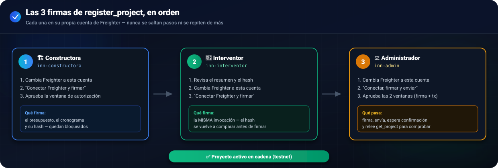

# 🖊️ Guía manual · registrar un proyecto en testnet con las 3 firmas

Paso a paso para probar `register_project` de punta a punta, con las firmas reales de Freighter de la constructora, el interventor y el administrador. Nadie automatiza las ventanas de Freighter: cada aprobación la haces tú, a mano, en el navegador.

<p align="center">
  
</p>

Hay dos formas de probarlo:

- **`testnet-registro.html`** (pasos de abajo): una página de prueba aislada, pensada para verificar la mecánica de las 3 firmas sin depender del resto de la app.
- **La app real** (`index.html?chain=testnet`, modo demostración — nunca con Supabase real): entra como constructora y envía/reenvía un proyecto en "Nuevo proyecto" (ahí te pide la firma de la constructora); como interventor, apruébalo desde "Solicitudes" (pide la firma del interventor); como administrador, valida y activa desde "Solicitudes" (pide la firma del administrador, envía la transacción y, si todo coincide, activa el proyecto). Ver `contracts/escrow/docs/ARQUITECTURA_ONCHAIN.md` sección 4 para el detalle de cómo quedó conectado. El resto de esta guía usa la página de prueba porque es más corta para depurar paso a paso.

## 🧰 Antes de empezar

1. Instala la [extensión Freighter](https://www.freighter.app) si no la tienes.
2. En Freighter, cambia la red a **Testnet** (menú de red, arriba).
3. Importa las 3 identidades de prueba en Freighter como 3 cuentas separadas (o usa 3 perfiles/navegadores distintos si prefieres no cambiar de cuenta a cada rato). El **orden en que debes estar parado en cada etapa es siempre el mismo: primero `inn-constructora`, luego `inn-interventor`, y al final `inn-admin`**. Las direcciones públicas están en `contracts/escrow/deployments/testnet.json` y también se muestran en la pantalla de prueba:

   | Etapa (en orden) | Nombre de identidad (CLI) | Dirección |
   |---|---|---|
   | 1️⃣ 🏗️ Constructora firma | `inn-constructora` | `GCYQDJ6UO3EHEL4GXLVMGTVTJEOV3OTWDJQPGSFTHPS2BCLRLT4OYRJS` |
   | 2️⃣ 🦺 Interventor firma | `inn-interventor` | `GAGEYZHS5LQPGQSK5YNQBCR6RKUJLSPO7ET4K76UJXZJUH6QZZ5PWEIW` |
   | 3️⃣ ⚖️ Administrador firma y envía | `inn-admin` | `GBP3BRO5XE3EG7YVSE74OQVFCK4XCOOCWCGXHTFEBTBLZCQ576EVMI7M` |

   Las llaves secretas de estas 3 cuentas **no están en el repositorio** — las creaste tú con `stellar keys generate` en el Paso 6 y viven en `~/.config/stellar/identity/`. Si necesitas importarlas a Freighter, exporta la frase/llave desde ahí con `stellar keys secret <nombre>` (nunca la pegues en el chat ni la guardes en ningún archivo del proyecto).

4. Levanta el servidor local desde `frontend/`:
   ```bash
   python -m http.server 4180
   ```

## 📝 Paso 1 — Datos del proyecto (sin Freighter)

1. Abre `http://localhost:4180/testnet-registro.html?chain=testnet`.
2. Confirma que arriba dice "Modo de cadena actual: **testnet**". Si dice "simulado", haz clic en "forzar testnet".
3. Deja el UUID generado automáticamente (o genera uno nuevo), ajusta el presupuesto si quieres, y deja los 6 hitos de ejemplo (o escribe los tuyos: 6 a 60 hitos, porcentajes en base 10000 sumando 10000, fechas futuras).
4. Clic en **"Calcular hash y guardar"**. Debe aparecer el hash SHA-256 del cronograma (64 caracteres hex). Esto solo guarda datos en tu navegador — nada se envía a la red todavía.

## 🏗️ Paso 2 — Firma de la constructora

1. En Freighter, **cambia a la cuenta de la constructora**.
2. Clic en **"Conectar Freighter y firmar (constructora)"**.
3. Freighter va a abrir dos ventanas seguidas:
   - Primero, pedir **conexión** (si es la primera vez en esta página) — apruébala.
   - Luego, pedir **aprobar la autorización** de `register_project` — revisa que el contrato y la cuenta sean los correctos y apruébala.
4. Si todo salió bien, la insignia de "Firma de la constructora" pasa a **firmado**.

**Si Freighter está en otra cuenta:** la página te lo dice explícitamente ("Cambia a la cuenta de constructora…") y no deja seguir. Cambia de cuenta en Freighter y vuelve a hacer clic.

**Si rechazas la ventana de Freighter:** la página muestra el error y el botón queda disponible para volver a intentarlo — no hay que empezar de cero.

## 🦺 Paso 3 — Firma del interventor

1. Clic en **"Ver resumen de lo que voy a firmar"**. Revisa que:
   - El hash recalculado coincida con el guardado (si no coincide, la página lo marca en rojo — no firmes).
   - Los datos del proyecto (presupuesto, direcciones, hitos) sean los esperados.
2. En Freighter, cambia a la cuenta del **interventor**.
3. Clic en **"Conectar Freighter y firmar (interventor)"** y aprueba la ventana de autorización.

**Si la firma de la constructora ya caducó** (su ventana es de 7 días, pensada para que la revisión humana pueda tardar; sería muy raro que pase en una prueba normal), la página se detiene aquí con el mensaje "La firma de constructora caducó, debe firmar de nuevo". Vuelve al Paso 2 — solo la constructora tiene que volver a firmar, nadie más pierde su firma.

## ⚖️ Paso 4 — Firma y envío del administrador

1. Clic en **"Ver resumen de lo que voy a firmar"** (misma comprobación que en el Paso 3).
2. En Freighter, cambia a la cuenta del **administrador**.
3. Clic en **"Conectar Freighter, firmar y enviar"**. Esta vez Freighter pide **dos** aprobaciones seguidas:
   - La autorización de `register_project` del administrador.
   - La **transacción completa** (porque el administrador es quien paga la tarifa y la envía).
4. La página espera la confirmación de la red (puede tardar unos segundos) y luego muestra:
   - ✅ "Proyecto activo en cadena"
   - El hash de la transacción (`tx`)
   - Un enlace al explorador de testnet
   - Los datos releídos con `get_project`, para comprobar que coinciden con lo que se firmó

## 🔎 Verificar con el script

1. En la sección "Estado guardado (depuración)" de la página, clic en **"Mostrar"** y copia ese JSON a un archivo, por ejemplo `estado.json`.
2. Desde la raíz del repositorio:
   ```bash
   node contracts/escrow/docs/verificar-registro.js estado.json
   ```
3. El script lee `get_project` y `get_milestone(0)` directamente del contrato (sin firmar nada) y compara cada campo contra lo que guardaste. Si algo no coincide, termina con un `✘` junto al campo y código de salida distinto de cero.

## 🤖 Prueba automatizada de punta a punta (sin Freighter)

Para no depender de aprobar ventanas a mano cada vez, `tools/e2e-testnet/` (fuera de `frontend/`, con su propio `package.json`) repite todo el flujo contra testnet real usando las llaves de `inn-constructora`/`inn-interventor`/`inn-admin` obtenidas al momento con la CLI de Stellar — nunca con Freighter, nunca guardadas en ningún archivo. Firma cada rol por separado (constructora → interventor → administrador), compara `get_project` al final, y además corre 5 casos negativos (cuenta equivocada, cronograma modificado, firma caducada, registro doble, porcentajes que no suman 100%).

```bash
./e2e-testnet.sh
```

(Es un atajo desde la raíz del repo; por dentro solo hace `cd tools/e2e-testnet && node run.js`. No usa Freighter ni necesita instalar nada con npm.)

Requisitos: tener el CLI `stellar` instalado y las identidades `inn-constructora`, `inn-interventor` e `inn-admin` ya creadas (`stellar keys ls`), con `inn-admin` fondeada en testnet (paga la tarifa de la transacción final). El script se niega a correr si detecta que la red no es exactamente testnet.

## 🧪 Firmar desde la app real sin cambiar de cuenta en Freighter cada vez

Si estás probando tú solo los 3 roles en la **app real** (no en `testnet-registro.html`), cambiar de cuenta en Freighter en cada paso es incómodo. `tools/test-signer/` es un servicio aparte que firma por ti con las 3 llaves, SOLO en testnet y SOLO en `localhost` — Freighter sigue siendo el proveedor real para producción/demo normal; esto es nada más una comodidad de prueba.

1. En otra terminal (déjala abierta mientras pruebas), arranca el servicio:
   ```bash
   cd tools/test-signer
   INNLOCK_TEST_SIGNER=1 node server.js
   ```
   Si falta la bandera, si la red no es testnet, o si las identidades no se llaman exactamente `inn-constructora`/`inn-interventor`/`inn-admin`, se niega a arrancar y te dice por qué.
2. Abre la app con `?chain=testnet` como siempre. En el paso 4 del asistente ("Nuevo proyecto") y en los modales de "Aprobar cronograma"/"Validar y activar" en Solicitudes, verás una casilla nueva: **"🧪 Firmar con el servicio de pruebas"**.
3. Márcala antes de hacer clic en el botón de firmar/aprobar/activar. Mientras esté marcada, esa acción (y las demás, queda guardado) firma a través del servicio — no se abre ninguna ventana de Freighter, no hace falta cambiar de cuenta.
4. Desmárcala cuando quieras volver a firmar con Freighter de verdad (por ejemplo, para la demostración final).

El servicio solo firma invocaciones a `register_project` sobre el contrato escrow de `contracts/escrow/deployments/testnet.json` — cualquier otra cosa la rechaza. Las 3 llaves se cargan una sola vez al arrancar (con `stellar keys secret <nombre>`) y quedan solo en memoria de ese proceso; para pruebas de ese servicio en sí (Origin ajeno, lista blanca, que ninguna llave se filtre a la consola), ver `tools/test-signer/__tests__/run.js` (`cd tools/test-signer && node __tests__/run.js`). Más detalle en `contracts/escrow/docs/ARQUITECTURA_ONCHAIN.md`.

## ⚠️ Problemas comunes

| Síntoma | Causa probable |
|---|---|
| "Cambia a la cuenta de constructora…" | Freighter está en otra cuenta. Cámbiala y repite. |
| "No se firmó: se rechazó la ventana…" | Rechazaste la aprobación en Freighter, o la cerraste. Vuelve a intentar. |
| "La firma de constructora/interventor caducó, debe firmar de nuevo" | Pasaron más de 7 días entre esa firma y la siguiente. Esa persona (solo ella) debe volver a firmar; en "Solicitudes" y en la ficha del proyecto aparece un botón "Firmar de nuevo" junto a su firma caducada. |
| Un mensaje que empieza con un texto reconocible (p. ej. "Este proyecto ya está registrado…") | El contrato rechazó la transacción; el mensaje ya viene traducido por `frontend/js/chain/errors.js`. |
| "El SDK de Stellar no se cargó" | Revisa que el modo sea testnet (`?chain=testnet`) y que `frontend/js/vendor/stellar.js` exista. |
| "No se pudo conectar con el servicio de pruebas…" (con la casilla 🧪 marcada) | `tools/test-signer` no está corriendo, o se cayó. Vuelve a arrancarlo (`INNLOCK_TEST_SIGNER=1 node server.js`) o desmarca la casilla para firmar con Freighter. |
