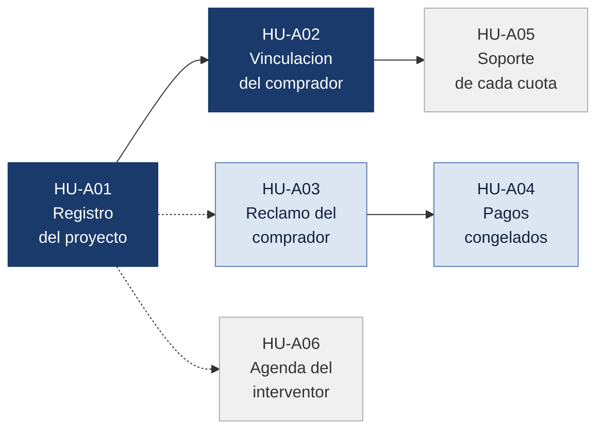

# Historias de usuario

### Vivienda sobre planos

**Ana María García Arias**

Bootcamp Blockchain, Ruta N BAF, Red Stellar
Octubre de 2026

### Contenido

**[1. Alcance](#1-alcance)** &nbsp;&nbsp; **[2. Roles considerados](#2-roles-considerados)** &nbsp;&nbsp; **[3. Mis historias de usuario](#3-mis-historias-de-usuario)** &nbsp;&nbsp; **[4. La más importante y por qué](#4-la-más-importante-y-por-qué)**

## 1. Alcance

Este documento reúne seis historias de usuario del producto que el equipo está diseñando: una plataforma donde las cuotas del comprador quedan retenidas y se liberan a la constructora por etapas, únicamente cuando un tercero independiente certifica el avance real de la obra.

Mis historias se concentran en los momentos que hacen posible ese mecanismo y que todavía no estaban cubiertos: la configuración del proyecto antes de recibir el primer peso, la vinculación de cada comprador, y lo que ocurre cuando alguien no está de acuerdo con lo que se certificó.

Los roles provienen de la tabla de actores del Problem Brief. Cada historia describe una acción que la persona necesita poder ejecutar en el producto, redactada de forma concreta y verificable, con un beneficio directo para quien la ejecuta.

## 2. Roles considerados

| Rol | Qué controla hoy, según el Problem Brief | Qué necesita del producto |
|---|---|---|
| **Comprador** | Nada. Solo recibe promesas | Quedar registrado como dueño de su aporte y poder reclamar si algo no cuadra |
| **Constructora** | Cronograma, calidad y fotos de avance | Dejar escritas las reglas del proyecto antes de vender la primera unidad |
| **Fiduciaria** | Saldos y transferencias, pero no verifica la obra | Poder frenar un desembolso cuando hay una disputa abierta |
| **Interventor** | Fotografías y reportes dispersos | Saber qué etapas están por vencer para organizar sus visitas |
| **Superintendencia de Industria y Comercio** | Recibe reclamos cuando ya es tarde | Ver el incumplimiento antes de que llegue la reclamación |

> Los cinco roles de la tabla de actores del Problem Brief quedan considerados. No escribí una historia para la Superintendencia porque Diana Carolina ya la cubrió en su propuesta (HU-D06, auditoría sin intermediarios), y duplicarla restaría cobertura al conjunto del equipo.

## 3. Mis historias de usuario

### Niveles de backlog

Para ordenar las historias me hice una sola pregunta: ¿qué pasa si entregamos el producto sin ella?

| Nivel | Qué significa |
|:---|:---|
| 🔴 **Imprescindible** | Si falta, el producto no resuelve el problema. La familia sigue perdiendo su dinero igual que hoy |
| 🟠 **Debería** | El dinero sigue protegido sin esto. Lo que falta es que la compradora se entere a tiempo y sepa qué puede hacer |
| 🟡 **Podría** | Le facilita el trabajo a la constructora o a la fiduciaria. Para la compradora el resultado no cambia |
| ⚪ **Queda fuera** | Tendría valor para el sector, pero no hace falta para demostrar que la solución funciona |

### Resumen

| | Código | Rol | Qué necesita poder hacer | Nivel |
|:---:|:---:|:---|:---|:---|
| 1 | **HU-A01** | Constructora | Registrar el proyecto con sus etapas y cuánto se paga por cada una | 🔴 **Imprescindible** |
| 2 | **HU-A02** | Comprador | Quedar registrado como dueño del aporte de su apartamento | 🔴 **Imprescindible** |
| 3 | **HU-A03** | Comprador | Reclamar cuando la obra no coincide con lo que certificaron | 🟠 **Debería** |
| 4 | **HU-A04** | Fiduciaria | Frenar los pagos de un proyecto mientras hay un reclamo abierto | 🟠 **Debería** |
| 5 | **HU-A05** | Comprador | Tener un soporte de cada cuota que sirva como prueba | 🟡 **Podría** |
| 6 | **HU-A06** | Interventor | Ver qué etapas están por vencerse para organizar sus visitas | ⚪ **Queda fuera** |

### Por qué cada historia quedó en ese nivel

**Imprescindibles: HU-A01 y HU-A02.** La primera define las reglas del juego antes de que entre el primer peso. Si nadie dejó escrito cuántas etapas tiene la obra y qué porcentaje se paga por cada una, no hay nada contra lo cual verificar ni liberar: el sistema no sabría cuándo soltar la plata. La segunda conecta el dinero con la persona. Sin ese registro, el producto guarda un monto que no está a nombre de nadie, y la compradora no podría demostrar que ese aporte es suyo.

**Deberían estar: HU-A03 y HU-A04.** Van juntas porque forman una sola idea. La certificación la hace una persona, y las personas se equivocan o pueden ser presionadas. Si la compradora ve que el edificio no está como dice el certificado y no tiene dónde reclamarlo, el sistema automatizó un error en lugar de corregirlo. Y de nada sirve reclamar si el dinero se libera igual mientras revisan: por eso la fiduciaria necesita poder frenar los pagos de ese proyecto hasta que el reclamo se resuelva.

**Podría estar: HU-A05.** El registro de la plataforma ya deja constancia de cada cuota recibida. El soporte individual le sirve a la compradora para llevarlo a una reclamación por fuera del sistema, ante la Superintendencia o ante un juez. Es un respaldo valioso, pero el dinero está igual de protegido con o sin él.

**Queda fuera: HU-A06.** Le ahorra trabajo al interventor y ayuda a que las certificaciones no se atrasen por desorden en la agenda. No cambia nada de lo que recibe la compradora, y un calendario puede llevarse por fuera mientras el producto madura.

### Relación entre las historias

> Todo nace del registro del proyecto: sin sus etapas definidas no hay a qué vincular al comprador, qué reclamar ni qué visitar. El reclamo y el congelamiento de pagos funcionan como una sola pieza, porque reclamar sin poder detener el dinero no protege a nadie.

### HU-A01. Registro del proyecto y sus etapas

| Rol | Nivel de backlog |
|:---|:---|
| Constructora | 🔴 Imprescindible |

> **Como** constructora,
> **quiero** registrar mi proyecto definiendo cada etapa de obra y el porcentaje del dinero que se libera al terminarla,
> **para** que las reglas de pago queden escritas y públicas antes de vender la primera unidad.

**Criterio de aceptación.** El proyecto no puede recibir aportes hasta que tenga todas sus etapas definidas, con su fecha comprometida y su porcentaje de liberación, y la suma de los porcentajes sea exactamente cien. Una vez abierto a los compradores, esas reglas no pueden modificarse sin dejar registro del cambio.

### HU-A02. Vinculación del comprador a su unidad

| Rol | Nivel de backlog |
|:---|:---|
| Comprador | 🔴 Imprescindible |

> **Como** compradora,
> **quiero** quedar registrada como dueña del aporte asociado a mi apartamento desde la primera cuota,
> **para** que mi dinero esté a mi nombre y nadie pueda discutir después cuánto puse ni por cuál unidad.

**Criterio de aceptación.** Cada aporte queda asociado a una compradora y a una unidad específica del proyecto. Dos compradores no pueden quedar vinculados a la misma unidad, y la compradora puede consultar en cualquier momento qué unidad tiene a su nombre y desde qué fecha.

### HU-A03. Reclamo sobre una certificación

| Rol | Nivel de backlog |
|:---|:---|
| Comprador | 🟠 Debería |

> **Como** compradora,
> **quiero** reportar que la obra no corresponde a lo que el interventor certificó,
> **para** que alguien lo revise antes de que se libere ese tramo de mi dinero.

**Criterio de aceptación.** La compradora abre un reclamo sobre una etapa certificada adjuntando su propia evidencia. El reclamo queda registrado con fecha y autor, es visible para la constructora, la fiduciaria y el interventor, y no puede cerrarse sin una respuesta escrita.

### HU-A04. Congelamiento de pagos durante un reclamo

| Rol | Nivel de backlog |
|:---|:---|
| Fiduciaria | 🟠 Debería |

> **Como** fiduciaria,
> **quiero** suspender los desembolsos de un proyecto mientras hay un reclamo sin resolver,
> **para** no entregar recursos sobre una etapa que está en discusión.

**Criterio de aceptación.** Al abrirse un reclamo, los desembolsos de la etapa señalada quedan bloqueados de forma automática. La fiduciaria puede extender el bloqueo a todo el proyecto, y ningún pago se reanuda hasta que el reclamo quede cerrado con su respuesta.

### HU-A05. Soporte verificable de cada cuota

| Rol | Nivel de backlog |
|:---|:---|
| Comprador | 🟡 Podría |

> **Como** compradora,
> **quiero** descargar un soporte de cada cuota que pago, con su fecha y su verificación,
> **para** poder probar lo que aporté ante una autoridad si algún día tengo que reclamar por fuera de la plataforma.

**Criterio de aceptación.** Cada aporte genera un soporte descargable con la fecha, el monto, la unidad y un código que permite comprobar en la plataforma que ese documento es auténtico y no fue alterado.

### HU-A06. Agenda de etapas por vencer

| Rol | Nivel de backlog |
|:---|:---|
| Interventor | ⚪ Queda fuera |

> **Como** interventor,
> **quiero** ver en un solo lugar las etapas próximas a vencerse de todos los proyectos que superviso,
> **para** organizar mis visitas y certificar a tiempo.

**Criterio de aceptación.** El interventor consulta una lista de las etapas que vencen en los próximos treinta días, ordenadas por fecha, con el proyecto al que pertenecen y los días que faltan para el vencimiento.

## 4. La más importante y por qué

### Criterio de ordenamiento

Ordené las historias según el momento en que cada una actúa dentro del ciclo del dinero. Primero van las que tienen que existir antes de que la compradora pague su primera cuota, porque si esas faltan no hay producto sobre el cual construir lo demás. Después van las que corrigen el sistema cuando algo sale mal, y al final las que facilitan el trabajo diario sin cambiar lo que recibe la familia.

### La más importante

> **HU-A01, el registro del proyecto y sus etapas,** es la más importante porque es la que convierte una promesa en una regla. Todo el valor de la solución depende de que exista una definición escrita, anterior a la venta, de qué se considera avance y cuánto se paga por él.

Hoy la constructora decide sobre la marcha qué significa que la obra avanzó y cuándo cobra, y el comprador se entera después. Si el proyecto no entra al sistema con sus etapas, sus fechas y sus porcentajes definidos desde el primer día, no hay forma de verificar nada: el interventor no sabría qué certificar, el dinero no sabría cuándo salir y la compradora volvería a depender de la palabra de alguien. Esta historia es la que hace posibles a todas las demás.

### Por qué HU-A02 va inmediatamente después

**HU-A02, la vinculación del comprador a su unidad,** ocupa el segundo lugar porque le pone nombre al dinero. De nada sirve que el producto retenga los aportes si no queda claro de quién es cada peso y a qué apartamento corresponde.

Esta historia además ataca un problema que aparece en el Problem Brief y que no es solo de información: los casos en los que una misma unidad termina vendida a dos personas. Al quedar cada unidad asociada a un único comprador desde la primera cuota, esa situación deja de ser posible.

Las cuatro historias restantes se apoyan sobre estas dos. HU-A03 y HU-A04 le dan a la compradora la posibilidad de discutir una certificación y de frenar el dinero mientras se revisa, HU-A05 le entrega una prueba que puede usar por fuera de la plataforma, y HU-A06 ayuda a que las certificaciones ocurran a tiempo.
