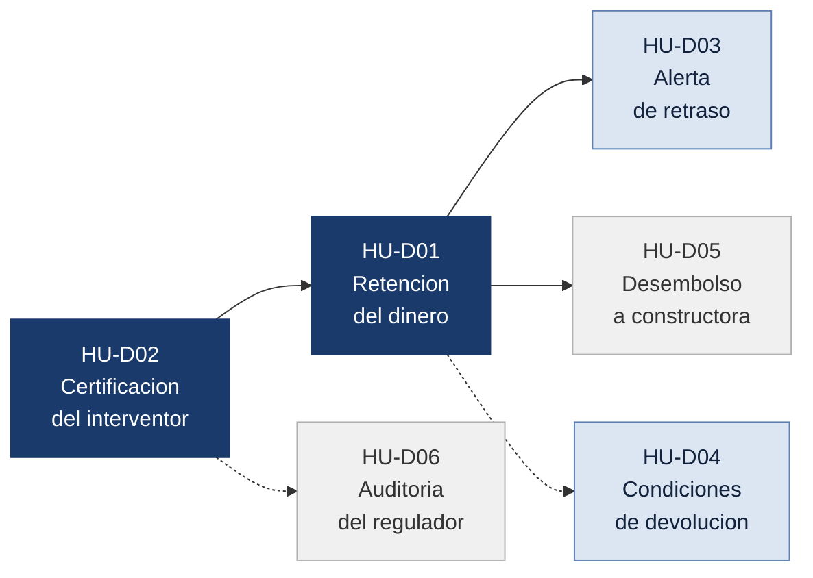

# Historias de usuario

### Vivienda sobre planos

**Diana Carolina González Díaz**

Bootcamp Blockchain, Ruta N BAF, Red Stellar
Octubre de 2026

### Contenido

**[1. Alcance](#1-alcance)** &nbsp;&nbsp; **[2. Roles considerados](#2-roles-considerados)** &nbsp;&nbsp; **[3. Mis historias de usuario](#3-mis-historias-de-usuario)** &nbsp;&nbsp; **[4. La más importante y por qué](#4-la-más-importante-y-por-qué)**

## 1. Alcance

Este documento reúne seis historias de usuario del producto que el equipo está diseñando: una plataforma donde las cuotas del comprador quedan retenidas y se liberan a la constructora por etapas, únicamente cuando un tercero independiente certifica el avance real de la obra.

Los roles provienen de la tabla de actores del Problem Brief. Cada historia describe una acción que la persona necesita poder ejecutar en el producto, redactada de forma concreta y verificable, con un beneficio directo para quien la ejecuta.

## 2. Roles considerados

| Rol | Qué controla hoy, según el Problem Brief | Qué necesita del producto |
|---|---|---|
| **Comprador** | Nada. Solo recibe promesas | Que su dinero no salga sin obra verificada |
| **Interventor** | Fotografías y reportes dispersos | Un canal donde su certificación tenga efecto sobre el dinero |
| **Constructora** | Cronograma, calidad y fotos de avance | Cobrar contra avance real sin depender de gestiones |
| **Fiduciaria** | Saldos y transferencias, pero no verifica la obra | Un registro de aportes que no dependa de su propia contabilidad |
| **Superintendencia de Industria y Comercio** | Recibe reclamos cuando ya es tarde | Ver el incumplimiento antes de que llegue la reclamación |

> Los cinco roles de la tabla de actores del Problem Brief quedan considerados. No escribí una historia para la fiduciaria porque Johan Mateo ya la cubrió en su propuesta (HU-05, registro inalterable de aportes), y duplicarla restaría cobertura al conjunto del equipo.

## 3. Mis historias de usuario

### Niveles de backlog

Para ordenar las historias me hice una sola pregunta: ¿qué pasa si entregamos el producto sin ella?

| Nivel | Qué significa |
|:---|:---|
| 🔴 **Imprescindible** | Si falta, el producto no resuelve el problema. La familia sigue perdiendo su dinero igual que hoy |
| 🟠 **Debería** | El producto funciona sin esto, pero deja sola a la compradora justo cuando necesita reaccionar |
| 🟡 **Podría** | Le facilita el trabajo a la constructora o a la fiduciaria. Para la compradora el resultado no cambia |
| ⚪ **Queda fuera** | Tendría valor para el sector, pero no hace falta para demostrar que la solución funciona |

### Resumen

| | Código | Rol | Qué necesita poder hacer | Nivel |
|:---:|:---:|:---|:---|:---|
| 1 | **HU-D01** | Comprador | Que su cuota no salga hasta que se certifique la etapa | 🔴 **Imprescindible** |
| 2 | **HU-D02** | Interventor | Certificar una etapa con fotos fechadas | 🔴 **Imprescindible** |
| 3 | **HU-D03** | Comprador | Recibir un aviso cuando una etapa se atrasa | 🟠 **Debería** |
| 4 | **HU-D04** | Comprador | Saber cómo y cuándo puede recuperar su dinero | 🟠 **Debería** |
| 5 | **HU-D05** | Constructora | Pedir el pago de una etapa ya certificada | 🟡 **Podría** |
| 6 | **HU-D06** | Superintendencia | Revisar el historial del proyecto sin pedírselo a nadie | ⚪ **Queda fuera** |

### Por qué cada historia quedó en ese nivel

**Imprescindibles: HU-D01 y HU-D02.** La primera es la que evita que la familia pierda la plata. Sin ella el producto solo informa, y la compradora termina igual que hoy: enterada, pero sin su dinero. La segunda existe porque la primera la necesita. Si nadie certifica que la etapa se terminó, el dinero se queda retenido para siempre y la obra se frena. Una no funciona sin la otra.

**Deberían estar: HU-D03 y HU-D04.** Con la retención la plata ya está protegida, pero falta que la compradora se entere a tiempo y sepa qué hacer. Sin el aviso sigue pagando cuotas de un proyecto detenido. Sin conocer las condiciones de devolución tiene el dinero guardado y no sabe cómo pedirlo. El mecanismo funciona sin estas dos, pero la deja sola en el momento en que más necesita reaccionar.

**Podría estar: HU-D05.** El pago a la constructora puede salir solo apenas llega la certificación, sin que ella tenga que pedirlo. Esta historia le da control sobre sus fechas de cobro, que ayuda a que acepte usar el sistema, pero a la compradora no le cambia nada.

**Queda fuera: HU-D06.** Permitiría que la Superintendencia detecte los incumplimientos antes de que lleguen las quejas, en vez de esperar a que las familias reclamen. Es valioso para el sector, pero requiere acuerdos con la entidad que no caben en una primera versión.

### Relación entre las historias

> Las dos historias imprescindibles forman el núcleo del producto. La certificación del interventor habilita la retención, y de la retención dependen tanto la alerta que recibe la compradora como el desembolso que recibe la constructora.

### HU-D01. Retención del dinero hasta la verificación

| Rol | Nivel de backlog |
|:---|:---|
| Comprador | 🔴 Imprescindible |

> **Como** compradora,
> **quiero** que cada cuota que pago quede retenida y se libere a la constructora solo cuando el interventor certifique la etapa correspondiente,
> **para** no perder mis ahorros si la obra se detiene.

**Criterio de aceptación.** Ninguna transferencia hacia la constructora se ejecuta sin una certificación de etapa asociada. La compradora puede ver en cualquier momento qué porcentaje de su aporte permanece retenido y qué porcentaje fue liberado, con la etapa que justificó cada liberación.

### HU-D02. Certificación de etapa con evidencia

| Rol | Nivel de backlog |
|:---|:---|
| Interventor | 🔴 Imprescindible |

> **Como** interventor,
> **quiero** certificar la terminación de una etapa adjuntando fotografías fechadas y el reporte técnico que la respalda,
> **para** que el desembolso de esa etapa quede habilitado con evidencia que después nadie pueda modificar.

**Criterio de aceptación.** La certificación queda registrada con la identidad del interventor, la fecha y los archivos de evidencia. Una vez emitida no puede editarse ni eliminarse, y habilita de forma automática el desembolso asociado a esa etapa.

### HU-D03. Alerta temprana de retraso

| Rol | Nivel de backlog |
|:---|:---|
| Comprador | 🟠 Debería |

> **Como** compradora,
> **quiero** recibir una alerta en el momento en que una etapa supera la fecha comprometida sin certificación,
> **para** reaccionar mientras mi dinero todavía está retenido y no dos años después.

**Criterio de aceptación.** El sistema notifica a la compradora el día siguiente al vencimiento de una etapa no certificada, indicando cuántos días de atraso acumula y cuánto de su aporte sigue retenido en ese momento.

### HU-D04. Condiciones de devolución del dinero

| Rol | Nivel de backlog |
|:---|:---|
| Comprador | 🟠 Debería |

> **Como** compradora,
> **quiero** consultar en lenguaje claro qué tipo de contrato firmé y bajo qué condiciones puedo recuperar mi dinero,
> **para** saber qué derechos tengo antes de seguir pagando.

**Criterio de aceptación.** La plataforma muestra si el documento firmado es una separación, un encargo fiduciario o una promesa de compraventa, junto con las causales de devolución, los plazos aplicables y el monto que la compradora recuperaría si se retira hoy.

### HU-D05. Solicitud de desembolso por etapa

| Rol | Nivel de backlog |
|:---|:---|
| Constructora | 🟡 Podría |

> **Como** constructora,
> **quiero** solicitar el desembolso de una etapa ya certificada y seguir el estado de esa solicitud,
> **para** planear mi flujo de caja con fechas ciertas y sin gestionar cada pago por teléfono.

**Criterio de aceptación.** La constructora solicita el desembolso únicamente sobre etapas con certificación vigente, y consulta el estado de cada solicitud en los estados solicitado, aprobado o desembolsado, con la fecha de cada cambio.

### HU-D06. Auditoría sin intermediarios

| Rol | Nivel de backlog |
|:---|:---|
| Superintendencia de Industria y Comercio | ⚪ Queda fuera |

> **Como** funcionario de la Superintendencia,
> **quiero** consultar el histórico de certificaciones y desembolsos de un proyecto sin solicitárselo a la constructora ni a la fiduciaria,
> **para** detectar un incumplimiento antes de que lleguen las reclamaciones de las familias.

**Criterio de aceptación.** El funcionario accede al histórico completo del proyecto con fechas de certificación, montos liberados y etapas vencidas sin certificar, sin requerir autorización de las partes vigiladas.

## 4. La más importante y por qué

### Criterio de ordenamiento

Las historias se ordenaron según el daño que evita cada una. El problema que el equipo eligió no es la falta de información en abstracto: es que el dinero de la familia sale de su cuenta sin que exista obra que lo respalde. Por eso encabezan la lista las historias que intervienen directamente sobre ese movimiento de dinero, siguen las que le permiten reaccionar a tiempo y cierran las que le ordenan el trabajo a la constructora y a la autoridad que vigila.

### La más importante

> **HU-D01, la retención del dinero hasta la verificación,** es la más importante porque es la única que cambia el resultado para la compradora cuando el proyecto falla. Las demás historias mejoran lo que ella sabe; esta cambia lo que ella pierde.

La diferencia es concreta. Una compradora que solo consulta información se entera antes del problema, pero igual ve salir su dinero. Una compradora cuyo aporte permanece retenido conserva el capital no liberado aunque la constructora se detenga. En los casos documentados en el Problem Brief, esa diferencia equivale a los noventa millones de pesos que una familia perdió por completo durante nueve años de reclamación.

### Por qué HU-D02 va inmediatamente después

**HU-D02, la certificación con evidencia,** ocupa el segundo lugar porque sostiene técnicamente a la primera. La retención de HU-D01 necesita un disparador confiable: alguien independiente tiene que afirmar que la etapa se terminó. Sin esa certificación, la retención bloquea el proyecto en lugar de protegerlo, porque el dinero nunca encontraría la condición que lo libera.

Estas dos historias forman el núcleo del producto. Las cuatro restantes amplían su alcance: HU-D03 y HU-D04 le dan a la compradora capacidad de reacción y comprensión de sus derechos, HU-D05 hace viable el modelo para la constructora, que de otro modo no lo adoptaría, y HU-D06 le permite a la Superintendencia prevenir el incumplimiento en lugar de llegar tarde a sancionarlo.
