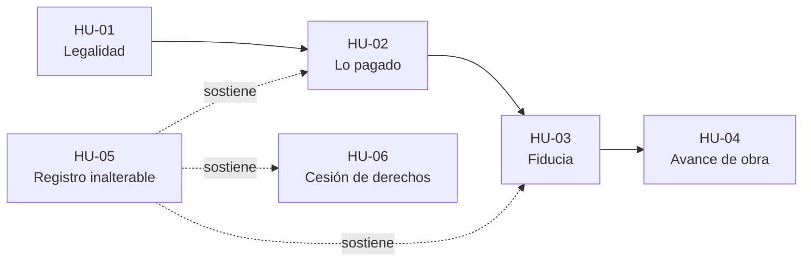

# Historias de usuario · Vivienda sobre planos - BlockChain

> Historias ordenadas **de mayor a menor importancia para el comprador**, que es el usuario principal del proyecto.
> Formato: **Como** [rol], **quiero** [acción], **para** [beneficio].

---

## Resumen de prioridades

| Prioridad | ID | Rol | Historia (resumen) |
|:---:|:---:|---|---|
| 🔴 1 | HU-01 | Comprador | Consultar los documentos legales de construcción |
| 🔴 2 | HU-02 | Comprador | Ver en cualquier momento cuánto ha pagado |
| 🟠 3 | HU-03 | Constructora | Mostrar que los recursos están protegidos en la fiducia |
| 🟠 4 | HU-04 | Comprador | Ver el avance de obra validado por la interventoría |
| 🟡 5 | HU-05 | Fiduciaria | Tener un registro inalterable de cada aporte |
| 🟢 6 | HU-06 | Inversionista | Verificar el historial de pagos antes de comprar el derecho |

**Leyenda:** 🔴 Crítica · 🟠 Alta · 🟡 Media · 🟢 Complementaria

---

## Historias de usuario

### 🔴 HU-01 · Legalidad del proyecto
**Rol:** Comprador

> **Como** comprador, **quiero** consultar los documentos legales de construcción, **para** tener certeza de la legalidad inicial del proyecto.

**Por qué va primero:** es la condición previa a todo lo demás. Si el proyecto no tiene licencia ni un respaldo legal válido, el comprador no debería pagar ni la primera cuota.

---

### 🔴 HU-02 · Control de lo pagado
**Rol:** Comprador

> **Como** comprador, **quiero** ver en cualquier momento cuánto he pagado, **para** tener la tranquilidad de que mi dinero no se pierde.

**Por qué va segunda:** es el temor más grande del comprador durante los meses en que paga cuotas por un apartamento que todavía no existe.

---

### 🟠 HU-03 · Recursos protegidos en la fiducia
**Rol:** Constructora

> **Como** constructora, **quiero** mostrar que los recursos están protegidos en la fiducia, **para** que los compradores confíen en los proyectos y se vinculen sin dudas.

**Por qué es alta:** aunque la escribe la constructora, el beneficio llega directo al comprador, que sabe que su plata está resguardada por un tercero.

---

### 🟠 HU-04 · Avance de obra verificado
**Rol:** Comprador

> **Como** comprador, **quiero** ver el avance de la obra validado por la interventoría, **para** saber si van a cumplir con la fecha de entrega.

**Por qué es alta:** cobra más importancia una vez arranca la construcción. Le permite al comprador anticipar retrasos y planear su mudanza o su crédito.

---

### 🟡 HU-05 · Registro inalterable de aportes
**Rol:** Fiduciaria

> **Como** fiduciaria, **quiero** un registro que nadie pueda alterar de cada aporte de los compradores, **para** facilitar las auditorías.

**Por qué es media:** el comprador se beneficia de forma indirecta, porque un registro confiable sostiene las historias HU-02 y HU-03.

---

### 🟢 HU-06 · Historial de pagos para cesión
**Rol:** Inversionista

> **Como** inversionista, **quiero** verificar el historial de pagos de un apartamento antes de comprar el derecho, **para** no heredar deudas ocultas.

**Por qué es complementaria:** solo aplica cuando un comprador quiere ceder su derecho o un inversionista quiere adquirirlo. Es útil, pero no hace parte del recorrido de la mayoría de compradores.

---

## Relación entre historias

> El **registro inalterable (HU-05)** es la base técnica donde blockchain aporta valor: de él dependen la confianza en lo pagado, en la fiducia y en la cesión de derechos.
