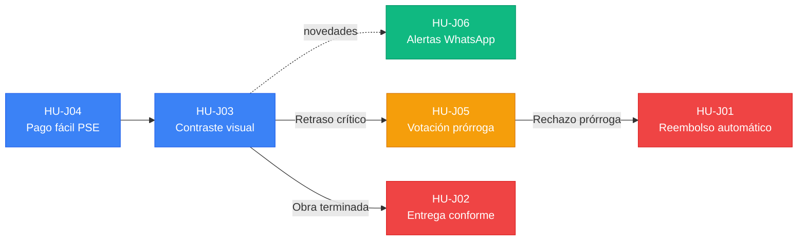

# Historias de usuario · Vivienda sobre planos

**Julián Correa**  
Bootcamp Blockchain · Ruta N BAF · Red Stellar · Octubre de 2026

> Historias ordenadas **de mayor a menor importancia para el comprador**, enfocadas en la experiencia del usuario y la protección de su patrimonio.  
> Formato: **Como** [rol], **quiero** [acción], **para** [beneficio].

---

## Resumen de prioridades

| Prioridad | ID | Rol | Historia (resumen) | Nivel |
|:---:|:---:|:---|:---|:---:|
| 🔴 1 | **HU-J01** | Comprador | Reembolso automático de cuotas retenidas si la obra se cancela o incumple | Crítica |
| 🔴 2 | **HU-J02** | Comprador | Retención de la última cuota hasta firmar el acta de entrega a satisfacción | Crítica |
| 🟠 3 | **HU-J03** | Comprador | Comparar fotos reales certificadas frente a los renders prometidos | Alta |
| 🟠 4 | **HU-J04** | Comprador | Pagar cuotas por PSE/banco con confirmación fiduciaria sin lidiar con cripto | Alta |
| 🟡 5 | **HU-J05** | Comprador | Votar la aprobación o rechazo de prórrogas de tiempo pedidas por la constructora | Media |
| 🟢 6 | **HU-J06** | Comprador | Recibir alertas en WhatsApp/móvil cuando el dinero se libere o haya novedades | Complementaria |

**Leyenda:** 🔴 Crítica · 🟠 Alta · 🟡 Media · 🟢 Complementaria

---

## Historias de usuario

### 🔴 HU-J01 · Reembolso automático por incumplimiento
**Rol:** Comprador

> **Como** comprador,  
> **quiero** solicitar y recibir el reembolso automático de mis fondos retenidos si el proyecto se cancela o supera el plazo de retraso permitido,  
> **para** recuperar mi dinero de inmediato sin quedar atrapado durante años en liquidaciones judiciales.

- **Criterio de aceptación:** Si la obra supera el plazo de tolerancia sin certificar avance, el comprador activa la devolución y los recursos retenidos regresan a su cuenta bancaria en menos de 5 días hábiles.
- **Por qué va primera:** Es la protección patrimonial definitiva. De nada sirve retener cuotas si ante una quiebra el comprador no puede recuperar su dinero.

---

### 🔴 HU-J02 · Entrega física a entera satisfacción
**Rol:** Comprador

> **Como** comprador,  
> **quiero** que el último 10% del dinero se libere a la constructora únicamente cuando firme el acta de recibo a satisfacción de mi apartamento,  
> **para** garantizar que corrijan defectos, acabados y daños antes de cobrar el saldo total.

- **Criterio de aceptación:** El desembolso final queda bloqueado hasta que el comprador apruebe la inspección física en la app; si hay reparaciones pendientes, los fondos permanecen retenidos hasta su subsanación.
- **Por qué va segunda:** Protege el momento más vulnerable de la compra: cuando entregan las llaves. Evita que la constructora abandone la postventa tras haber cobrado todo.

---

### 🟠 HU-J03 · Contraste visual render vs. realidad
**Rol:** Comprador

> **Como** comprador,  
> **quiero** contrastar en pantalla el render comercial que me vendieron contra las fotos reales certificadas de cada etapa,  
> **para** constatar con claridad y sin tecnicismos que lo construido coincide con lo prometido.

- **Criterio de aceptación:** La interfaz muestra un comparador visual con fecha y georreferenciación de la obra vs. las maquetas comerciales ofertadas.
- **Por qué es alta:** Ataca la asimetría informativa del comprador, quien suele pagar a ciegas guiado solo por publicidad engañosa.

---

### 🟠 HU-J04 · Pago accesible sin fricción técnica
**Rol:** Comprador

> **Como** comprador,  
> **quiero** pagar mis cuotas mensuales mediante PSE o débito bancario con confirmación fiduciaria inmediata,  
> **para** abonar de forma sencilla y segura sin tener que comprar criptomonedas ni gestionar llaves complejas.

- **Criterio de aceptación:** El pago se realiza por canales bancarios estándar y acredita el saldo en custodia en menos de 2 minutos, emitiendo comprobante verificable.
- **Por qué es alta:** Garantiza adopción real. Si pagar requiere conocimientos técnicos de Web3, las familias no usarán la plataforma.

---

### 🟡 HU-J05 · Votación comunitaria de prórrogas
**Rol:** Comprador

> **Como** comprador,  
> **quiero** votar si acepto o rechazo las solicitudes de prórroga de cronograma que radique la constructora,  
> **para** que los aplazamientos no se aprueben unilateralmente a espaldas de los compradores.

- **Criterio de aceptación:** Las extensiones de tiempo requieren la aprobación de al menos el 60% de los propietarios vinculados mediante votación digital de 1 voto por unidad.
- **Por qué es media:** Es valiosa para la gobernanza del proyecto ante imprevistos, pero el producto opera con plazos contractuales fijos si no se incluye.

---

### 🟢 HU-J06 · Notificaciones proactivas de fondos
**Rol:** Comprador

> **Como** comprador,  
> **quiero** recibir avisos inmediatos en WhatsApp o SMS cada vez que se libere un pago o cambie el estado de mi obra,  
> **para** mantenerme informado del destino de mi plata sin tener que ingresar diariamente a la aplicación.

- **Criterio de aceptación:** Envío automático de mensaje móvil no sensible ante acreditaciones de cuotas, hitos completados o alertas de retraso.
- **Por qué es complementaria:** Brinda tranquilidad y comodidad, pero la misma información puede consultarse directamente en el panel web.

---

## La más importante y por qué

### Criterio de ordenamiento
Las historias se organizaron bajo el principio de **mitigación del daño patrimonial irreversible**. Primero se resuelven las situaciones donde el comprador puede perder su capital o recibir una vivienda en mal estado; luego la transparencia visual y operativa diaria; y finalmente los canales de soporte e información pasiva.

### La más importante: HU-J01 (Reembolso automático)
> **HU-J01 es la historia principal.** La gran tragedia de la vivienda sobre planos en Colombia (como Doña Leonor en Barranquilla con \$90 millones perdidos) es que cuando una obra se desploma, los compradores quedan atrapados en liquidaciones fiduciarias donde los bancos cobran primero y las familias se quedan sin nada. La retención del dinero solo tiene sentido si existe una **garantía de devolución automática** ante el incumplimiento.

### Por qué HU-J02 le sigue inmediatamente
**HU-J02** equilibra el poder en el momento de la entrega física. Hoy las constructoras exigen el 100% del pago antes de entregar las llaves, perdiendo incentivo para solucionar imperfecciones. Condicionar el último desembolso al visto bueno del comprador asegura que el inmueble se entregue en condiciones dignas.

---

## Relación entre historias

