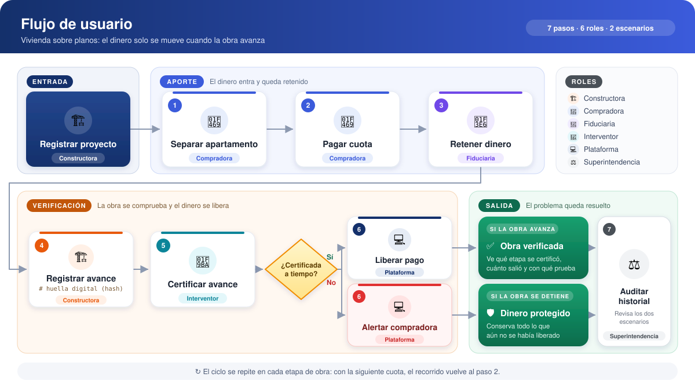
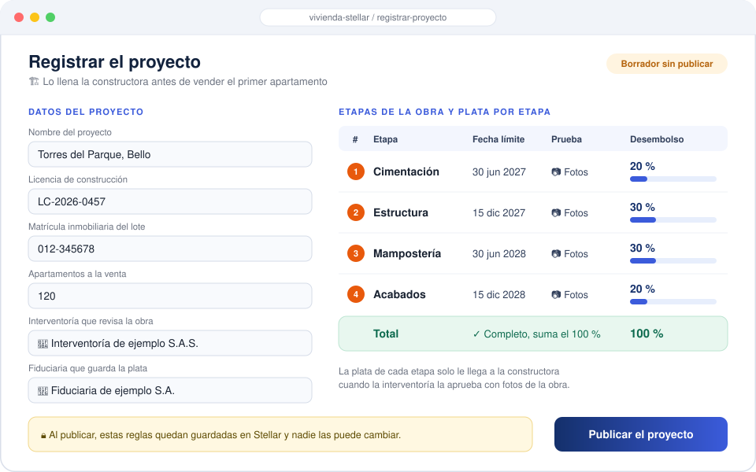
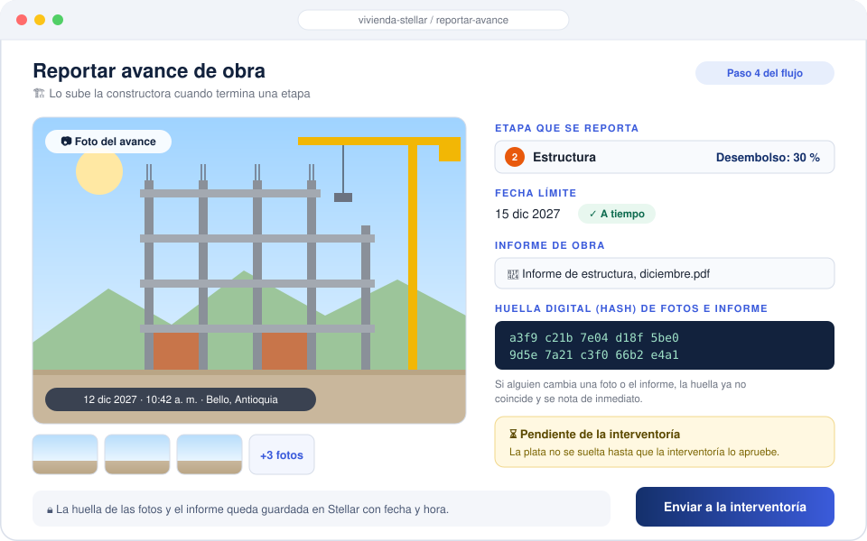

# Product Blueprint

**Proyecto:** Vivienda sobre planos
**Entregable grupal, semana 2**
Bootcamp Blockchain, Ruta N BAF, Red Stellar. Octubre de 2026

## 1. Priorización de historias

El problema tiene dos causas: las familias **no saben dónde está su dinero** y **no pueden verificar si la obra avanza**. Elegimos 5 historias que forman el ciclo mínimo de protección: reglas, aporte registrado, retención, certificación y alerta.

| # | Historia de usuario | Qué resuelve |
|---|---|---|
| HU1 | **Constructora:** registrar el proyecto con cada etapa de obra y el porcentaje que se libera al terminarla, con reglas públicas antes de vender la primera unidad. | Define contra qué se verifica y cuándo se libera el dinero. |
| HU2 | **Compradora:** quedar registrada como dueña del aporte de su apartamento desde la primera cuota. | Cada peso queda trazado a una persona y a una unidad. |
| HU3 | **Compradora:** que cada cuota quede retenida y se libere a la constructora solo cuando el interventor certifique la etapa. | El dinero no se mueve sin avance real. |
| HU4 | **Interventor:** certificar la terminación de una etapa con fotos fechadas y reporte técnico que nadie pueda modificar. | Da evidencia objetiva e inalterable del avance. |
| HU5 | **Compradora:** recibir una alerta cuando una etapa supera la fecha comprometida sin certificación. | Permite reaccionar mientras el dinero sigue retenido. |

**Criterios de priorización**

1. **Alineación con el problema:** cada historia ataca la falta de control del dinero o la falta de verificación del avance.
2. **Dependencia habilitadora:** sin HU1 no existe HU4, y sin HU4 no funciona HU3. Las historias que requieren este ciclo base quedan para después.
3. **Reducción del riesgo de pérdida:** la retención condicionada y la alerta de retraso atacan directamente el desvío de recursos y la obra detenida.
4. **No redundancia:** se descartaron historias cubiertas por las elegidas, como ver cuánto he pagado, el registro inalterable de aportes y ver el avance validado.
5. **Cobertura de actores:** participan constructora, compradora e interventor. La fiduciaria actúa como custodio en HU3.
6. **Valor frente a esfuerzo:** se aplazaron historias con alta complejidad legal u operativa, como el reembolso automático, la votación de prórrogas y la retención del último 10%.

## 2. Propuesta de valor

Para **Laura**, que lleva dos años pagando cumplido su primer apartamento con cesantías y ahorros sin ver avance real, la plataforma cambia la confianza por evidencia: su dinero solo se mueve cuando la obra avanza de verdad.

**Qué resultado obtiene**

- Antes de comprar, conoce las etapas de obra y cuánto dinero se libera en cada una (HU1).
- Desde la primera cuota, su aporte queda registrado a su nombre y asociado a su apartamento (HU2).
- Cada cuota queda retenida y solo pasa a la constructora cuando el interventor certifica la etapa con fotos fechadas y un reporte técnico que nadie puede modificar (HU3, HU4).
- Si una etapa se retrasa, recibe una alerta inmediata, mientras su dinero sigue protegido (HU5).

**En qué se diferencia de cómo lo resuelve hoy**

| Hoy | Con la plataforma |
|---|---|
| Confía en la reputación de la constructora. | Confía en reglas públicas y evidencia verificable. |
| La fiduciaria cobra entre 1 y 2% y guarda el dinero, pero no verifica la obra. | El dinero se libera solo contra una certificación de avance. |
| Visita la obra un día al mes y recibe renders que no corresponden a la realidad. | Ve fotos fechadas y certificadas de cada etapa, sin desplazarse. |
| Descubre el problema años después y termina en demandas. | Se entera a tiempo y tiene soporte de cada peso aportado. |

**Por qué la elegiría**

La plataforma no le pide confiar más, sino le permite verificar. Así reduce el triple costo que hoy paga Laura: protege sus ahorros, llega a cualquier reclamo con pruebas en lugar de años de trámites y cambia la angustia por información clara. Lo que en casos como Avi Puerto Colombia tardó nueve años o más en resolverse, aquí se detecta en la misma etapa en que ocurre.

## 3. Flujo de usuario

  

| Etapa | Rol | Entra en | Qué hace |
|---|---|:---:|---|
| Entrada | 🏗️ Constructora | Registrar proyecto | Registra licencia, matrícula, apartamentos, etapas de obra, fecha y porcentaje de cada etapa (deben sumar cien), interventor y fiduciaria. Sin un campo, no recibe dinero |
| Aporte | 👩 Compradora | Pasos 1 y 2 | Revisa etapas, fechas y porcentajes. Separa con arras: queda a su nombre el derecho sobre el apartamento, no la propiedad, que llega con la escritura. Luego paga sus cuotas |
| Aporte | 🏦 Fiduciaria | Paso 3 | Recibe arras y cuotas y las mantiene retenidas. No entrega nada a la constructora sin una etapa certificada |
| Verificación | 🏗️ Constructora | Paso 4 | Termina la etapa y registra el avance: la huella digital (hash) de fotos y documentos queda en la red, así nadie puede alterarlos después |
| Verificación | 🦺 Interventor | Paso 5 | Visita la obra y certifica la etapa con fotos fechadas y reporte técnico. La certificación emitida no se puede modificar |
| Verificación | 💻 Plataforma | Paso 6 | Si la etapa se certificó a tiempo, libera solo el porcentaje pactado. Si venció el plazo, alerta a la compradora y el dinero sigue retenido |
| Salida | ⚖️ Superintendencia | Paso 7 | Revisa el historial del proyecto cuando lo necesita |

**Cómo se encadenan.** Ningún rol puede saltarse al anterior: sin cuota no hay retención, sin obra no hay certificación y sin certificación no hay pago.

**Salida.** El ciclo se repite en cada etapa. Si la obra avanzó, la compradora ve qué etapa se certificó y con qué evidencia salió su dinero. Si se detuvo, conserva todo lo no liberado.

## 4. Alcance del MVP

El MVP es un piloto en la red de pruebas de Stellar: un proyecto de cuatro etapas con una constructora, un interventor y compradoras de prueba. Valida una sola hipótesis: si el dinero solo sale contra una certificación, la compradora protege su ahorro y sabe en qué va la obra.

**Dentro: funcionalidad central**

| Funcionalidad | Historia | Paso |
|---|:---:|:---:|
| Registrar el proyecto con etapas, fechas y porcentajes | HU1 | Entrada |
| Registrar a la compradora y su derecho sobre el apartamento | HU2 | 1 |
| Retener arras y cuotas | HU3 | 2 y 3 |
| Registrar el avance con huella digital (hash) | HU4 | 4 |
| Certificar y liberar el porcentaje pactado | HU3 y HU4 | 5 y 6 |
| Alertar por etapa vencida | HU5 | 6 |

  

  

**Fuera: funcionalidad deseable**

| Funcionalidad | Por qué después |
|---|---|
| Reembolso automático | Requiere validación legal con las fiduciarias |
| Votación de prórrogas | No cambia la protección básica |
| Retención del último 10% | Depende de la escrituración final |
| Panel para la Superintendencia | El historial ya se puede consultar en la red |

**Cómo sabremos que funciona**

1. Ningún desembolso sale sin una certificación previa.
2. La compradora ve cuánto aportó, cuánto sigue retenido y qué evidencia justificó cada salida.
3. Una etapa vencida genera la alerta al día siguiente.

**Por qué el recorte entrega valor.** Las seis funciones atacan las dos causas del problema: el dinero que no se ve y el avance que no se verifica. Lo que queda fuera mejora la experiencia, pero no cambia el resultado: si la obra se detiene, la compradora conserva todo lo no liberado.

## 5. Lean Canvas

<!-- Lienzo de una página con el modelo del producto: problema, segmento de usuarios,
     propuesta de valor única, solución, canales, métricas clave, ventaja diferencial
     y estructura de costos e ingresos.
     Formato: imagen o enlace. -->

## 6. Backlog priorizado (Kanban)

<!-- Enlace al tablero en GitHub Projects, construido con las historias priorizadas,
     en columnas y con criterios de aceptación por tarjeta.
     Formato: enlace al tablero. -->

## 7. Arquitectura inicial

<!-- Cómo se conectan las partes (interfaz, lógica, Stellar) y en qué punto entra la red.
     Diagrama simple.
     Extensión: 150 a 300 palabras. -->

## 8. Uso de Stellar y justificación

<!-- Qué componentes de Stellar usaría y por qué cada uno.
     Apoyado en el criterio de pertinencia del Problem Brief.
     Extensión: 150 a 300 palabras. -->
