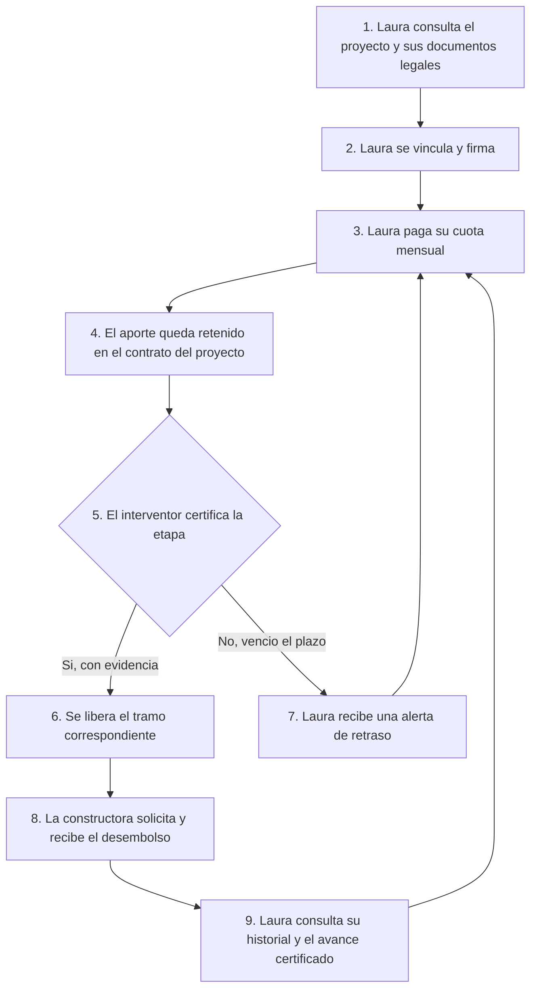
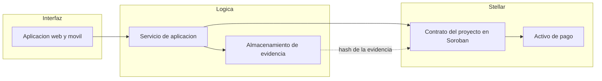

# Product Blueprint

**Proyecto:** Vivienda sobre planos
**Entregable grupal, semana 2**
Bootcamp Blockchain, Ruta N BAF, Red Stellar. Octubre de 2026

**Equipo:** Diana Carolina González Díaz, Ana María García Arias, Johan Mateo Castañeda Mejía, Julián Correa

## 1. Priorización de historias

De las historias propuestas por el equipo se seleccionaron siete para el backlog. El criterio de priorización fue el daño que evita cada historia: primero las que intervienen sobre el movimiento del dinero, después las que permiten reaccionar a tiempo y por último las que sostienen la operación de los demás actores.

| Orden | Historia | Rol | Origen |
|:---:|---|---|---|
| 1 | Retención de la cuota hasta la certificación de la etapa | Comprador | HU-D01 |
| 2 | Certificación de etapa con evidencia fechada | Interventor | HU-D02 |
| 3 | Consulta de los documentos legales del proyecto | Comprador | HU-01 |
| 4 | Consulta de lo pagado en cualquier momento | Comprador | HU-02 |
| 5 | Consulta del avance de obra validado por interventoría | Comprador | HU-04 |
| 6 | Solicitud de desembolso de una etapa certificada | Constructora | HU-D05 |
| 7 | Alerta cuando una etapa supera su fecha comprometida | Comprador | HU-D03 |

Quedan fuera del backlog inicial cinco historias que no son necesarias para demostrar el valor central: la cesión de derechos a un inversionista (HU-06), la auditoría directa de la Superintendencia (HU-D06), la consulta de condiciones de devolución (HU-D04), el registro de aportes para la fiduciaria (HU-05) y la presentación de la fiducia como argumento comercial (HU-03). Las historias individuales de Ana María García Arias y Julián Correa se incorporarán a esta priorización cuando estén publicadas.

## 2. Propuesta de valor

Laura, la compradora descrita en el Problem Brief, obtiene un resultado concreto: su dinero deja de ser un pago a ciegas y pasa a ser un depósito condicionado. Cada cuota que transfiere queda retenida y solo llega a la constructora cuando un interventor independiente certifica que la etapa correspondiente de la obra se terminó, adjuntando evidencia fotográfica fechada.

La diferencia con la situación actual es medible. Hoy Laura paga durante dos o tres años sin saber si el edificio está en cimientos o en acabados, porque la única información que recibe es el mismo render que vio en la sala de ventas. Si el proyecto se detiene, se entera cuando ya entregó todo su capital, y su única salida es una reclamación que puede tardar nueve años. Con esta solución, el dinero que todavía no tiene obra que lo respalde permanece retenido, y una alerta le avisa el día siguiente al vencimiento de una etapa no certificada.

Laura elegiría esta solución porque no le pide confiar en la palabra de la constructora ni en la diligencia de la fiduciaria, que son precisamente los dos actores que fallaron en los casos documentados. La certificación proviene de un tercero técnico, el registro no lo controla ninguna de las partes y la regla de liberación se ejecuta sola. Para la constructora el beneficio también es real: un proyecto que opera bajo este esquema puede mostrar a sus compradores una garantía verificable y diferenciarse en un mercado donde más de setenta mil viviendas siguen sin entregarse.

## 3. Flujo de usuario

El recorrido va desde la vinculación de Laura al proyecto hasta la liberación del último tramo de su aporte.

Los puntos de interacción por rol son cuatro. **Laura, la compradora**, consulta los documentos legales antes de vincularse, paga su cuota, recibe alertas y consulta en cualquier momento cuánto ha aportado, cuánto permanece retenido y qué etapa fue certificada. **El interventor** certifica cada etapa adjuntando fotografías fechadas y su reporte técnico, que es el único evento capaz de habilitar un desembolso. **La constructora** consulta las etapas certificadas, solicita el desembolso correspondiente y sigue el estado de esa solicitud. **La fiduciaria** mantiene su rol legal de administración, pero deja de ser la fuente única de verdad sobre los saldos, porque el registro es consultable por todas las partes.

El flujo es cíclico entre los pasos tres y nueve: cada mes Laura aporta, el sistema retiene, el interventor certifica si hay avance y el dinero se libera por tramos hasta el cierre del proyecto.

## 4. Alcance del MVP

**Dentro del alcance.** El MVP implementa el ciclo completo de retención y liberación condicionada para un proyecto de vivienda con cuatro etapas de obra. Incluye el registro del proyecto con sus etapas y porcentajes de desembolso, la vinculación de compradores, la recepción de aportes, la certificación de etapas por parte del interventor con evidencia asociada, la liberación automática del tramo correspondiente, la solicitud de desembolso por parte de la constructora y la consulta del estado por parte del comprador, con alertas por etapa vencida.

**Fuera del alcance.** Quedan fuera la cesión de derechos entre compradores e inversionistas, la integración con los sistemas internos de las fiduciarias, el panel de auditoría para la Superintendencia, la gestión de subsidios estatales, el crédito hipotecario y la tokenización de la unidad de vivienda como activo transferible.

**Por qué este recorte sigue entregando valor.** El problema que el equipo eligió no es la falta de información en abstracto, sino que el dinero sale de la cuenta de la familia sin obra que lo respalde. El recorte conserva íntegro el mecanismo que ataca esa causa y descarta todo lo que amplía el alcance comercial o institucional del producto. Una compradora que use solo el MVP ya obtiene el cambio material completo: conserva el capital no liberado si la obra se detiene. Las funcionalidades excluidas mejoran la adopción y la escala, pero ninguna modifica ese resultado, de modo que su ausencia no invalida la demostración de valor.

## 5. Lean Canvas

Enlace al lienzo: *pendiente de publicación por el equipo.*

El contenido acordado para el lienzo es el siguiente.

| Bloque | Contenido |
|---|---|
| Problema | Las familias pagan cuota inicial durante años sin poder verificar si la obra avanza ni dónde está su dinero |
| Segmento de usuarios | Compradores de primera vivienda sobre planos que financian con cesantías, subsidios o ahorros |
| Propuesta de valor única | La cuota solo se mueve cuando la obra avanza, certificada por un tercero independiente |
| Solución | Retención condicionada de aportes con liberación por etapas contra certificación con evidencia |
| Canales | Constructoras aliadas en el punto de venta, fiduciarias y gremios del sector |
| Métricas clave | Porcentaje de aportes retenidos sobre el total, etapas certificadas a tiempo, tiempo entre certificación y desembolso, alertas de retraso emitidas |
| Ventaja diferencial | Registro que ninguna de las partes puede alterar y regla de liberación que se ejecuta sin intervención humana |
| Estructura de costos | Desarrollo y mantenimiento de la plataforma, costos de red, integración con interventoría |
| Fuentes de ingreso | Comisión por proyecto administrado, cobrada a la constructora como garantía comercial |

## 6. Backlog priorizado (Kanban)

Enlace al tablero en GitHub Projects: *pendiente de creación por el equipo.*

El tablero se construye con las siete historias priorizadas en la sección 1, una tarjeta por historia, con el criterio de aceptación de cada una en la descripción de la tarjeta. Las columnas acordadas son cuatro: Por hacer, En progreso, En revisión y Terminado.

## 7. Arquitectura inicial

La solución tiene tres capas. La **interfaz** es la aplicación donde Laura consulta su estado y recibe alertas, el interventor carga la certificación y la constructora solicita el desembolso. El **servicio de aplicación** gestiona identidades, notificaciones y la carga de archivos, y traduce las acciones de cada rol en transacciones firmadas.

La **red Stellar** entra en el punto exacto donde se decide el movimiento del dinero. El contrato del proyecto, desplegado en Soroban, custodia los aportes, guarda las etapas con su porcentaje de liberación y ejecuta la regla de desembolso cuando recibe una certificación válida del interventor autorizado. La evidencia fotográfica no se almacena en la red: se guarda fuera de cadena y solo su huella criptográfica queda registrada en el contrato, de modo que cualquier alteración posterior del archivo sea detectable sin encarecer la operación.

La frontera es deliberada. Todo lo que puede cambiar sin consecuencias, como la interfaz o las notificaciones, vive fuera de la red. Todo lo que debe ser incuestionable para las partes que no confían entre sí, es decir el saldo retenido, la certificación y la liberación, vive dentro.

## 8. Uso de Stellar y justificación

El Problem Brief sostiene que este caso requiere un registro distribuido por dos criterios: varias partes que no confían entre sí necesitan compartir un mismo registro, y el histórico no puede alterarse. Los componentes elegidos responden a esos dos criterios.

**Contratos inteligentes en Soroban.** Son el componente central. Custodian los aportes y ejecutan la liberación por etapas sin que ninguna de las partes pueda intervenir la decisión. Esto responde al segundo criterio: la regla que libera el dinero deja de ser una promesa contractual y pasa a ser código que se ejecuta solo, y el histórico de certificaciones y desembolsos queda escrito de forma que nadie puede reescribir.

**Activo de pago sobre Stellar.** Las cuotas se representan en un activo estable denominado en pesos, emitido por un anchor local. Esto permite que el valor retenido no fluctúe mientras espera la certificación, lo cual es indispensable cuando el periodo de retención dura meses.

**Cuentas con firma delegada.** El interventor firma sus certificaciones con una identidad propia registrada en el contrato. Así la certificación es atribuible a una persona concreta y no a la constructora, que es justamente el actor que hoy controla la información del avance.

**Anchors para entrada y salida de dinero.** Permiten que Laura aporte en pesos desde su banco y que la constructora reciba en pesos, sin que ninguno de los dos tenga que operar con criptoactivos.

La elección de Stellar sobre otras redes se apoya en el costo por transacción y en la finalidad en segundos. El modelo exige registrar un aporte por comprador cada mes durante dos o tres años: en un proyecto de doscientas unidades son miles de transacciones anuales, de modo que una red con comisiones altas trasladaría ese costo a la familia y destruiría el beneficio que la solución promete.
