# Product Blueprint

**Proyecto:** Vivienda sobre planos
**Entregable grupal, semana 2**
Bootcamp Blockchain, Ruta N BAF, Red Stellar. Octubre de 2026

## 1. Priorización de historias

El problema tiene dos causas: las familias **no saben dónde está su dinero** y **no pueden verificar si la obra avanza**. Elegimos 5 historias que forman el ciclo mínimo de protección: reglas, aporte registrado, retención, certificación y alerta.

| # | Historia de usuario | Qué resuelve |
|---|---|---|
| HU1 | **Constructora:** registrar el proyecto con cada etapa de obra y el porcentaje que se libera al terminarla, con reglas públicas antes de vender la primera unidad. | Define contra qué se verifica y cuándo se libera el dinero. |
| HU2 | **Compradora:** quedar registrada como dueña del aporte de su apartamento desde la primera cuota. | Cada peso queda trazado a una persona y a una unidad. |
| HU3 | **Compradora:** que cada cuota quede retenida y se libere a la constructora solo cuando el interventor certifique la etapa. | El dinero no se mueve sin avance real. |
| HU4 | **Interventor:** certificar la terminación de una etapa con fotos fechadas y reporte técnico que nadie pueda modificar. | Da evidencia objetiva e inalterable del avance. |
| HU5 | **Compradora:** recibir una alerta cuando una etapa supera la fecha comprometida sin certificación. | Permite reaccionar mientras el dinero sigue retenido. |

**Criterios de priorización**

1. **Alineación con el problema:** cada historia ataca la falta de control del dinero o la falta de verificación del avance.
2. **Dependencia habilitadora:** sin HU1 no existe HU4, y sin HU4 no funciona HU3. Las historias que requieren este ciclo base quedan para después.
3. **Reducción del riesgo de pérdida:** la retención condicionada y la alerta de retraso atacan directamente el desvío de recursos y la obra detenida.
4. **No redundancia:** se descartaron historias cubiertas por las elegidas, como ver cuánto he pagado, el registro inalterable de aportes y ver el avance validado.
5. **Cobertura de actores:** participan constructora, compradora e interventor. La fiduciaria actúa como custodio en HU3.
6. **Valor frente a esfuerzo:** se aplazaron historias con alta complejidad legal u operativa, como el reembolso automático, la votación de prórrogas y la retención del último 10%.

## 2. Propuesta de valor

Para **Laura**, que lleva dos años pagando cumplido su primer apartamento con cesantías y ahorros sin ver avance real, la plataforma cambia la confianza por evidencia: su dinero solo se mueve cuando la obra avanza de verdad.

**Qué resultado obtiene**

- Antes de comprar, conoce las etapas de obra y cuánto dinero se libera en cada una (HU1).
- Desde la primera cuota, su aporte queda registrado a su nombre y asociado a su apartamento (HU2).
- Cada cuota queda retenida y solo pasa a la constructora cuando el interventor certifica la etapa con fotos fechadas y un reporte técnico que nadie puede modificar (HU3, HU4).
- Si una etapa se retrasa, recibe una alerta inmediata, mientras su dinero sigue protegido (HU5).

**En qué se diferencia de cómo lo resuelve hoy**

| Hoy | Con la plataforma |
|---|---|
| Confía en la reputación de la constructora. | Confía en reglas públicas y evidencia verificable. |
| La fiduciaria cobra entre 1 y 2% y guarda el dinero, pero no verifica la obra. | El dinero se libera solo contra una certificación de avance. |
| Visita la obra un día al mes y recibe renders que no corresponden a la realidad. | Ve fotos fechadas y certificadas de cada etapa, sin desplazarse. |
| Descubre el problema años después y termina en demandas. | Se entera a tiempo y tiene soporte de cada peso aportado. |

**Por qué la elegiría**

La plataforma no le pide confiar más, sino le permite verificar. Así reduce el triple costo que hoy paga Laura: protege sus ahorros, llega a cualquier reclamo con pruebas en lugar de años de trámites y cambia la angustia por información clara. Lo que en casos como Avi Puerto Colombia tardó nueve años o más en resolverse, aquí se detecta en la misma etapa en que ocurre.

## 3. Flujo de usuario

```mermaid
flowchart LR
    subgraph ENT["ENTRADA<br/>Se fijan las reglas"]
        direction TB
        E(["Constructora<br/>Registra licencia, apartamentos,<br/>etapas, fechas y porcentajes"])
    end

    subgraph APO["PASOS 1 a 4<br/>El dinero entra y queda retenido"]
        direction TB
        P1("1. Compradora<br/>Consulta las reglas")
        P2("2. Compradora<br/>Separa y paga arras")
        P3("3. Compradora<br/>Paga su cuota")
        P4("4. Fiduciaria<br/>Retiene el dinero")
        P1 --> P2 --> P3 --> P4
    end

    subgraph VER["PASOS 5 a 7<br/>La obra se verifica y el dinero se libera"]
        direction TB
        P5("5. Constructora<br/>Construye la etapa")
        P6("6. Interventor<br/>Certifica con fotos fechadas")
        D{"¿Certificada<br/>a tiempo?"}
        P7("7. Plataforma<br/>Libera ese porcentaje")
        AL("7b. Alerta a la compradora<br/>El dinero sigue retenido")
        P5 --> P6 --> D
        D -- Sí --> P7
        D -- No --> AL
    end

    subgraph SAL["SALIDA<br/>El problema queda resuelto"]
        direction TB
        S1(["La obra avanzó<br/>Ve la etapa certificada, cuánto<br/>dinero salió y con qué evidencia"])
        S2(["La obra se detuvo<br/>Conserva todo lo que<br/>aún no se había liberado"])
        SIC("8. Superintendencia<br/>Revisa el historial completo")
    end

    E --> P1
    P4 --> P5
    P7 --> S1
    AL --> S2
    S1 --> SIC
    S1 -. siguiente etapa .-> P3

    classDef constructora fill:#FFF1E0,stroke:#D9822B,color:#4A2A05,stroke-width:1.5px
    classDef compradora fill:#E7EEFC,stroke:#3B5BDB,color:#14254F,stroke-width:1.5px
    classDef fiduciaria fill:#F1E9FB,stroke:#7B4FC4,color:#2E1757,stroke-width:1.5px
    classDef interventor fill:#E3F5F2,stroke:#1F8A78,color:#0B3B33,stroke-width:1.5px
    classDef plataforma fill:#1A3A6B,stroke:#1A3A6B,color:#FFFFFF,stroke-width:1.5px
    classDef decision fill:#FFF8E1,stroke:#C99A06,color:#4A3A00,stroke-width:1.5px
    classDef alerta fill:#FDECEA,stroke:#C8372D,color:#5A1410,stroke-width:1.5px
    classDef salida fill:#0E6B4F,stroke:#0E6B4F,color:#FFFFFF,stroke-width:1.5px
    classDef regulador fill:#F2F2F2,stroke:#8A8A8A,color:#333333,stroke-width:1.5px

    class E,P5 constructora
    class P1,P2,P3 compradora
    class P4 fiduciaria
    class P6 interventor
    class P7 plataforma
    class D decision
    class AL alerta
    class S1,S2 salida
    class SIC regulador

    style ENT fill:#FAFBFD,stroke:#1A3A6B,stroke-width:1px,color:#1A3A6B
    style APO fill:#FAFBFD,stroke:#3B5BDB,stroke-width:1px,color:#14254F
    style VER fill:#FAFBFD,stroke:#1F8A78,stroke-width:1px,color:#0B3B33
    style SAL fill:#F3FAF7,stroke:#0E6B4F,stroke-width:1px,color:#0E6B4F

    linkStyle default stroke:#5B6B85,stroke-width:1.5px
```

**Entrada.** Antes de vender el primer apartamento, la constructora registra el proyecto: licencia de construcción, matrícula del lote, apartamentos disponibles, las etapas de obra en orden (cimentación, estructura, mampostería, acabados), su fecha comprometida, el porcentaje que libera cada una (deben sumar cien) y los datos del interventor y la fiduciaria. Sin un solo campo, el proyecto no recibe dinero.

**Pasos intermedios.** Los roles se encadenan: la fiduciaria no retiene si no hay cuota, el interventor no certifica si no hay obra y la plataforma no libera si no hay certificación. Ninguno puede saltarse al anterior. Al separar, la compradora aún no es dueña, porque la propiedad llega con la escritura: lo que queda a su nombre es el derecho sobre ese apartamento, y sus arras se retienen como las cuotas.

| Rol | Entra en | Qué hace |
|---|:---:|---|
| Constructora | Entrada y paso 5 | Registra el proyecto y construye cada etapa |
| Compradora | Pasos 1 a 3 | Revisa reglas, separa con arras y paga cuotas |
| Fiduciaria | Paso 4 | Recibe el dinero y lo mantiene retenido |
| Interventor | Paso 6 | Certifica la etapa con fotos fechadas |
| Superintendencia | Paso 8 | Revisa el historial cuando lo necesita |

**Salida.** El ciclo se repite en cada etapa y cierra las dos preguntas que hoy la compradora no puede responder. Si la obra avanzó, ve qué etapa se certificó, cuánto dinero salió y con qué evidencia. Si la obra se detuvo, recibe la alerta y conserva todo lo que aún no se había liberado. En los dos escenarios se cumple la promesa de la sección anterior: el dinero solo se mueve cuando la obra avanza de verdad.

## 4. Alcance del MVP

<!-- Funcionalidad central separada de lo que queda fuera.
     Justificación de por qué ese recorte sigue entregando valor.
     Extensión: 150 a 300 palabras. -->

## 5. Lean Canvas

<!-- Lienzo de una página con el modelo del producto: problema, segmento de usuarios,
     propuesta de valor única, solución, canales, métricas clave, ventaja diferencial
     y estructura de costos e ingresos.
     Formato: imagen o enlace. -->

## 6. Backlog priorizado (Kanban)

<!-- Enlace al tablero en GitHub Projects, construido con las historias priorizadas,
     en columnas y con criterios de aceptación por tarjeta.
     Formato: enlace al tablero. -->

## 7. Arquitectura inicial

<!-- Cómo se conectan las partes (interfaz, lógica, Stellar) y en qué punto entra la red.
     Diagrama simple.
     Extensión: 150 a 300 palabras. -->

## 8. Uso de Stellar y justificación

<!-- Qué componentes de Stellar usaría y por qué cada uno.
     Apoyado en el criterio de pertinencia del Problem Brief.
     Extensión: 150 a 300 palabras. -->
