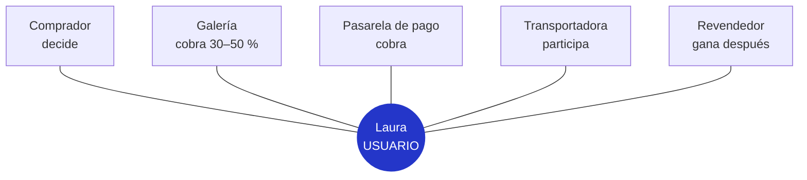
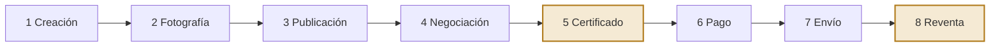
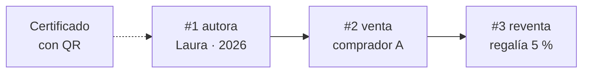
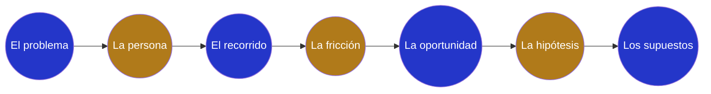

# La prueba de la obra

### ¿Cómo prueba una artista que la obra es *suya*?

> **Caso de aplicación · Del concepto al problema**
> Recorremos el método en cuatro salas, como una exposición. Cada sala responde una pregunta con el caso de Laura, una pintora que vende su obra original por internet. La tecnología (blockchain) solo aparece al final, cuando ya sabemos qué problema resuelve.

| Persona | Canal | Ciudad | Tecnología candidata |
|---|---|---|---|
| Laura R., pintora | Instagram y WhatsApp | Medellín | Blockchain |

> 🖼️ **Río Medellín III** — Laura R. · 2026
> Óleo sobre lienzo · 80 × 60 cm · $2.400.000 COP
> ✕ *Autenticidad no verificable*

**Índice:** [I · Enunciar](#sala-i--cómo-se-enuncia-un-problema) · [II · Quién](#sala-ii--quién-lo-sufre) · [III · Hoy](#sala-iii--cómo-se-resuelve-hoy) · [IV · Oportunidad](#sala-iv--cómo-se-pasa-de-ahí-a-una-oportunidad) · [Método](#método-completo) · [Próximo paso](#próximo-paso)

---

## Sala I · ¿Cómo se enuncia un problema?

### Una frase. Sin blockchain, sin tokens, sin contratos.

> Un buen enunciado nombra a una persona, dice qué le pasa y qué pierde por eso. Si menciona la solución o la tecnología, todavía no es un problema.

### Tres borradores: cómo se afina la frase

| | Borrador | Por qué |
|---|---|---|
| ❌ **Borrador 1** | *"Queremos hacer un marketplace con NFTs en blockchain para vender arte."* | Describe una solución, no un problema. No hay persona ni pérdida. Arranca por la tecnología. |
| 〰️ **Borrador 2** | *"Los artistas no pueden proteger su arte en internet."* | Mejor, pero "los artistas" es un grupo y "proteger" es vago. No dice qué pierden ni cuándo. |
| ✅ **Enunciado final** | ***"Una pintora emergente de Medellín que vende por Instagram no puede demostrar que una obra es original y suya, y el comprador le paga menos porque no lo puede verificar."*** | Tiene una persona concreta, un contexto, una causa y una consecuencia que se puede medir en pesos. |

> 💡 **El mejor problema es uno que ya vivieron o vieron de cerca.**

---

## Sala II · ¿Quién lo sufre?

### Una persona sufre el problema. Muchos otros participan.

> El usuario es quien pierde algo, y es una persona, no un grupo. Los actores participan en el proceso, cobran o deciden, pero el problema no es de ellos.

### Usuario · Ficha

**Laura R.** — Pintora independiente. Sin galería que la represente.

| | |
|---|---|
| **Edad** | 29 años |
| **Oficio** | Óleo y acrílico, formato mediano |
| **Taller** | Compartido, centro de Medellín |
| **Canales** | Instagram (8.400 seguidores) y WhatsApp |
| **Ventas** | 3 a 6 obras al mes |
| **Precio** | $1,5 a $3 millones COP por obra |

> *"Cuando alguien de afuera me escribe, lo primero que pregunta es cómo sabe que el cuadro es mío."*
> Persona ilustrativa · cita de ejemplo

### Mapa de actores

| **Usuario** | **Actores** |
|---|---|
| Sufre el problema. Si nada cambia, Laura sigue vendiendo barato y pierde el rastro de su obra. | Participan, cobran o deciden. Si nada cambia, a ellos les va igual o incluso mejor. |

**Pregunta de control**
- [ ] ¿Podemos ponerle nombre y cara al usuario?
- [ ] ¿Distinguimos a quien pierde de quien decide o cobra?
- [ ] ¿Sabemos qué actor podría frenar una solución?

---

## Sala III · ¿Cómo se resuelve hoy?

### El recorrido de una obra, del caballete a la reventa

> Antes de proponer algo nuevo, se describe lo que la persona ya hace, paso por paso. La pregunta clave es una sola: **¿en qué paso pierde algo?**

| # | Paso | Qué hace hoy | Qué pierde | Pérdida |
|---|---|---|---|---|
| 1 | Creación | Pinta la obra en su taller. Firma en la esquina inferior. | Nada todavía. | ○○○ |
| 2 | Fotografía | Toma fotos con el celular, con luz del día. | Terceros pueden copiar las fotos y usarlas. | ●○○ |
| 3 | Publicación | Sube la obra a Instagram con precio "por DM". | Cuentas falsas revenden su obra o imitan su estilo. | ●○○ |
| 4 | Negociación | Conversa por mensaje directo y WhatsApp. | Le piden rebaja "porque no conocen su trabajo". | ●●○ |
| **5** | **Certificado de autenticidad** | **Imprime un certificado en papel, lo firma y lo mete en el paquete.** | **⚠️ Fricción principal:** el papel se falsifica fácil, no está ligado a la obra y nadie lo puede verificar. | ●●● |
| 6 | Pago | Transferencia bancaria o link de pago. | El comprador teme pagar y no recibir. La pasarela cobra comisión. | ●○○ |
| 7 | Envío | Transportadora nacional o internacional. | Daño o pérdida, con poca trazabilidad. | ●○○ |
| **8** | **Reventa** | **Años después, la obra cambia de dueño sin ningún registro.** | **⚠️ Fricción secundaria:** no sabe dónde está su obra ni recibe nada de la reventa. | ●●● |

### ¿Cuánto pierde en una venta?

*Río Medellín III, vendida por Instagram*

| Concepto | Valor |
|---|---:|
| Precio que pide | $2.400.000 |
| Rebaja por desconfianza | −$500.000 |
| Comisión de la pasarela | −$85.000 |
| **Lo que recibe** | **$1.815.000** |

> **$0** es lo que recibe si en 5 años la obra se revende por $6.000.000.
> Cifras ilustrativas para el caso

**Pregunta de control**
- [ ] ¿Describimos lo que hace hoy, sin inventar pasos nuevos?
- [ ] ¿Sabemos en qué paso pierde algo y cuánto?
- [ ] ¿Se lo mostramos a Laura y dijo "sí, así es"?

---

## Sala IV · ¿Cómo se pasa de ahí a una oportunidad?

### De la fricción a lo que tendría que ser cierto

> Cuatro pasos que van cerrando el foco: dónde duele, qué dolor elegimos, qué cambiaría sin él y qué tendríamos que comprobar antes de construir.

### 1 · Fricción
*En qué paso pasa, por qué pasa, a quién le pasa.*

| En qué paso | Por qué pasa | A quién le pasa |
|---|---|---|
| **Certificado de autenticidad** (paso 5 del recorrido) | **El papel no prueba nada:** no está ligado a la obra ni a la artista, y cualquiera lo imprime. | **A Laura, y de rebote al comprador:** ella cobra menos; él asume el riesgo de un falso. |

### 2 · Oportunidad
*La fricción que eligen atacar, y por qué esa.*

| Estado | Fricción | Razón |
|---|---|---|
| ✅ **Elegida** | **Verificar autenticidad y procedencia** | Es la que más baja el precio, y resolverla también ordena la reventa. |
| ❌ Descartada | Pago seguro | Ya hay pasarelas y pagos contra entrega que funcionan. |
| ❌ Descartada | Envío con seguro | Las transportadoras ofrecen seguro y rastreo. |

### 3 · Hipótesis
*Qué cambiaría para la persona si esa fricción no existiera.*

> Si cualquier comprador pudiera **verificar en segundos, desde su celular,** que la obra es original de Laura y quiénes han sido sus dueños, Laura **vendería a mejor precio, a compradores que no la conocen** y **recibiría un porcentaje en cada reventa.**

`Si` la verificación es inmediata → `entonces` sube el precio pagado → `y` se abren compradores lejanos → `y` hay ingreso en la reventa

### 4 · Supuestos
*Qué tendría que ser cierto para que funcione.*

**Matriz de supuestos (importancia vs. evidencia que tenemos)**

| | Poca evidencia | Mucha evidencia |
|---|---|---|
| **Alta importancia** | 🔵 **VALIDAR PRIMERO:** S1, S4 | Vigilar: S3, S6 |
| **Menor importancia** | Después: S2, S5 | — |

| # | Supuesto | Prioridad |
|---|---|---|
| **S1** | **Los compradores pagarían más por una obra verificada.** | 🔵 Validar primero |
| **S4** | **El comprador puede verificar sin saber de tecnología: sin billeteras ni criptomonedas.** | 🔵 Validar primero |
| S3 | Hay una forma confiable de ligar la obra física a su registro: QR, chip NFC o huella fotográfica. | Vigilar |
| S6 | El costo del registro es menor que el aumento de precio que genera. | Vigilar |
| S2 | Laura registraría cada obra si le toma pocos minutos. | Después |
| S5 | Los revendedores usarían el registro y aceptarían pagar la regalía. | Después |

### Solo aquí entra la tecnología

**Blockchain, como herramienta para dos supuestos.**

Un registro público que no se puede alterar puede guardar quién creó la obra y quiénes han sido sus dueños. Eso ayuda con **S3** (ligar la obra a su registro) y con **S5** (que la reventa quede registrada y pague regalía).

**S1 y S4 no se resuelven con código.** Se validan hablando con compradores, antes de construir.

**Pregunta de control**
- [ ] ¿Elegimos una sola fricción y sabemos por qué esa?
- [ ] ¿La hipótesis habla de lo que cambia para la persona, no de la tecnología?
- [ ] ¿Sabemos qué supuesto validar primero?

---

## Método completo

### Las siete piezas, en una sola línea

| Pieza | Aplicada al caso |
|---|---|
| **El problema** | Laura no puede probar que la obra es suya y cobra menos. |
| **La persona** | Pintora de Medellín que vende por Instagram. |
| **El recorrido** | Ocho pasos, de la creación a la reventa. |
| **La fricción** | El certificado en papel no se puede verificar. |
| **La oportunidad** | Hacer verificable la autenticidad y la procedencia. |
| **La hipótesis** | Con verificación, vende más caro y cobra en la reventa. |
| **Los supuestos** | S1 y S4 primero: ¿pagan más? ¿verifican sin tecnicismos? |

---

## Próximo paso

### Salir a validar, antes de construir

> Diez conversaciones valen más que un prototipo. Estas preguntas prueban los supuestos más riesgosos sin mencionar la solución.

#### Para validar S1 · 5 a 10 entrevistas con compradores de arte en línea
1. Cuéntame de la última obra que compraste por internet. ¿Cómo supiste que era original?
2. ¿Alguna vez dejaste de comprar porque no estabas seguro? ¿Qué pasó?
3. Si pudieras comprobar la autoría en el momento, ¿cambiaría lo que estás dispuesto a pagar?

*Señal positiva: describen una duda real, con fecha y monto.*

#### Para validar S4 y S2 · 5 entrevistas con artistas independientes
1. ¿Cómo le demuestras hoy a un comprador que la obra es tuya?
2. ¿Qué te han pedido los compradores para confiar? ¿Alguien pidió rebaja por eso?
3. ¿Cuántos minutos le dedicarías a registrar cada obra? ¿Cuánto pagarías?

*Señal positiva: ya hacen algo para probarlo, y les cuesta.*

---

Caso de aplicación · Método "Del concepto al problema" · Persona, cita y cifras ilustrativas. Versión web: abre `index.html` en el navegador.
