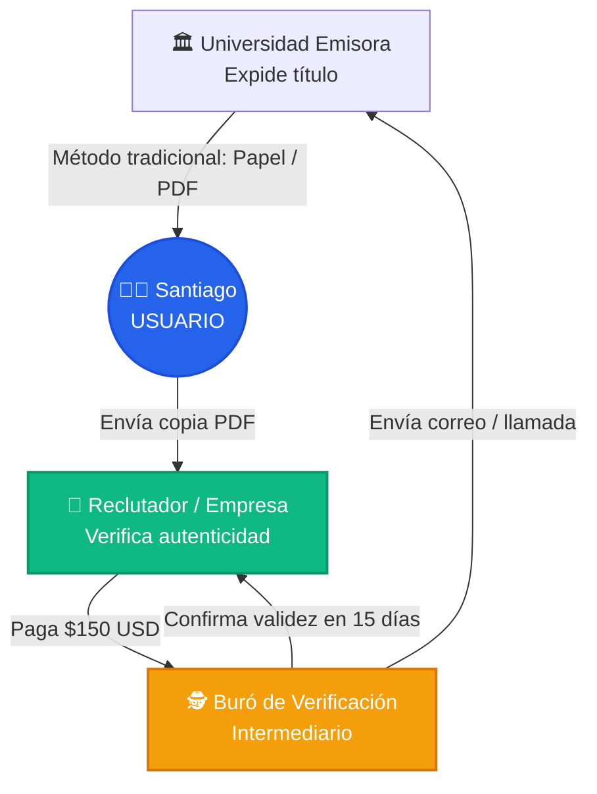
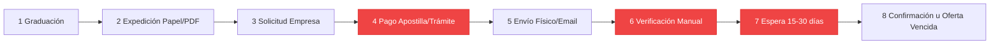
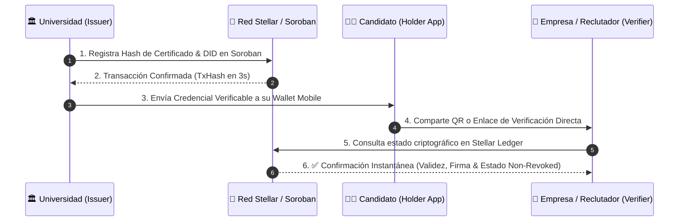

# 🎓 Sistema Descentralizado de Emisión y Verificación de Credenciales Académicas
**Propuesta Individual · Fase 1: Identificación y Análisis del Problema**

---

### 👤 Información del Autor & Proyecto
- **Autor:** Julián Correa (Lead UX/UI Designer & Blockchain Systems Analyst)
- **Programa:** Bootcamp Blockchain · Ruta N BAF · Red Stellar (Septiembre 2026)
- **Dominio:** EdTech / Decentralized Identity (DID) & Verifiable Credentials (VC)
- **Estado:** 🟢 Propuesta Presentada · Lista para Evaluación

---

> 💡 **Resumen Ejecutivo:**
> La falsificación de títulos y los cuellos de botella en procesos de homologación internacional le cuestan a profesionales y empresas miles de dólares y semanas de espera. Esta propuesta plantea una arquitectura de **Credenciales Verificables Inmutables sobre la Red Stellar**, permitiendo validaciones en tiempo real (3 segundos) con un costo cercano a \$0 USD y sin intermediarios centralizados.

---

## 📌 1. El Problema (Enunciado Claro y Concreto)

> **"La dependencia de registros centralizados y formatos físicos o digitales fácilmente manipulables para la emisión, almacenamiento y validación de títulos y certificados académicos genera vulnerabilidades críticas de seguridad, riesgos legales y semanas de demoras burocráticas en procesos de selección profesional e internacional."**

### 🔍 Borradores y Evolución del Enunciado

| Versión | Enunciado | Evaluación |
|---|---|---|
| ❌ **Borrador 1** | *"Queremos hacer una dApp en Stellar para subir diplomas como NFTs y evitar fraudes."* | 🔴 **Incorrecto:** Describe la tecnología y solución antes de entender el problema real. |
| 〰️ **Borrador 2** | *"Las universidades tardan mucho en verificar certificados de graduados."* | 🟡 **Impreciso:** No refleja a los usuarios impactados ni el costo o riesgo involucrado. |
| ✅ **Enunciado Final** | ***"La dependencia de registros centralizados y formatos físicos o digitales fácilmente manipulables para la emisión y validación de títulos genera vulnerabilidades críticas de seguridad, altos costos operativos y demoras burocráticas de semanas en procesos de selección e integración laboral."*** | 🟢 **Excelente:** Nombra a los involucrados, el contexto, la causa raíz y las consecuencias cuantitativas. |

---

## 👥 2. ¿Quién lo sufre? (UX Personas & Mapa de Actores)

### 👤 User Persona 1: El Candidato / Profesional
> **Santiago Morales (26 años)** — Ingeniero de Sistemas en Medellín.  
> *"Conseguí una oferta remota para una startup en Alemania, pero llevo 3 semanas esperando la apostilla y validación de mi título. Corro el riesgo de que cancelen mi oferta por vencimiento de términos."*

- **Frustración:** Tiempos muertos de 15 a 30 días en apostillas y cartas de verificación institucional.
- **Pérdida:** Riesgo real de perder oportunidades laborales de alto valor ($3.500+ USD/mes).
- **Necesidad UX:** Portabilidad total e inmediata de su acreditación sin depender de la ventanilla o disponibilidad de la universidad.

### 🏢 User Persona 2: El Reclutador / Empresa
> **Elena Vance (34 años)** — Lead Technical Recruiter en GlobalTech.  
> *"Recibimos más de 500 postulaciones al mes. Detectar diplomas adulterados o pedir verificación a universidades extranjeras nos cuesta presupuesto en agencias de background check y ralentiza las contrataciones."*

- **Frustración:** Alto porcentaje de inconsistencias documentales en Hojas de Vida (hasta 15% en el mercado global).
- **Pérdida:** \$150–\$300 USD gastados por candidato en agencias de verificación externa + semanas de retraso en onboarding.

### 🏛️ Actor Institucional: La Universidad Emisora
> **Dr. Roberto Mendoza** — Director de Admisiones y Registro Académico.  
> *"El 40% del tiempo de nuestro personal operativo se consume respondiendo correos, llamadas y peticiones formales de verificación de títulos expedidos hace años."*

---

### 🗺️ Mapa de Actores e Interacciones Activas



---

## ⏳ 3. ¿Cómo se resuelve hoy y qué cuesta? (Flujo Actual & Matriz de Fricciones)

### 📉 Flujo del Proceso Actual (8 Pasos Tradicionales)



### 📊 Tabla de Fricciones y Costos Operativos

| # | Paso del Flujo | Método Actual | Qué se Pierde / Riesgo | Nivel de Fricción |
|---|---|---|---|---|
| 1 | **Expedición** | Impresión de diploma físico o PDF estático | Fácil falsificación con herramientas de edición visual (Photoshop, Acrobat). | 🟡 Media |
| 2 | **Presentación** | El graduado envía adjunto el PDF o escaneo | No existe sello de autenticidad criptográfica ni firma digital verificable. | 🟡 Media |
| 3 | **Verificación HR** | La empresa contrata un Buró de Verificación | **Costo directo:** \$80 – \$300 USD por validación de expediente. | 🔴 **CRÍTICA** |
| 4 | **Trámite Institucional** | Notarías, Cancillería (Apostilla), Universidad | **Costo de tiempo:** 15 a 45 días hábiles de espera burocrática. | 🔴 **CRÍTICA** |
| 5 | **Revocación / Auditoría** | Títulos anulados por fraude no tienen registro público | La empresa contratante **nunca se entera** si el título fue revocado a futuro. | 🔴 **CRÍTICA** |

### 💰 Desglose Económico del Problema por Verificación

```
[Proceso Tradicional por Candidato]
┌──────────────────────────────────────────────────────────┐
│ Tarifa de Apostilla & Legalización:     $45 - $90 USD   │
│ Buró de Background Check / Auditoría:  $120 - $250 USD  │
│ Costo de Oportunidad (3 semanas salario): $1.500+ USD    │
├──────────────────────────────────────────────────────────┤
│ TOTAL COSTO / FRICCIÓN ACUMULADA:       ~$1.700 USD / Caso │
└──────────────────────────────────────────────────────────┘
```

---

## ⚡ 4. Propuesta de Solución e Hipótesis Blockchain (Red Stellar)

### 💡 Hipótesis Personal: ¿Por qué Blockchain (Stellar)?

La arquitectura de **Registros Distribuidos e Inmutables** permite resolver este cuello de botella al eliminar al tercero intermediario que tradicionalmente concentra y monopoliza la confianza.

1. **Confianza Trustless entre partes sin relación previa:** La Universidad expide una credencial firmada criptográficamente sobre la **Red Stellar (Soroban Smart Contracts)**. Cualquier empresa externa o entidad de homologación puede validar la firma en segundos sin consultar a la universidad ni pagar a intermediarios.
2. **Registro Inmutable y Anti-Adulteración:** La firma/hash del certificado queda indexado en la blockchain de Stellar. Modificar un solo carácter del documento altera el hash criptográfico, invalidando la prueba de forma instantánea.
3. **Control Descentralizado de Revocaciones:** Si un título debe ser revocado por plagio o sanción administrativa, la institución ejecuta una actualización inmutable en la red sin alterar el historial preexistente.
4. **Eficiencia Técnica de la Red Stellar:** Transacciones con costos de **<\$0,00001 USD** y finalidad de **3 a 5 segundos**, ideal para volumen masivo de credenciales educativas a escala internacional.

---

## 🔄 5. Flujo Propuesto (UX Descentralizado con Stellar)



---

## 📱 6. Diseño UX / UI & Wireframes Mockups

Como líder de UX/UI del equipo, se ha estructurado la arquitectura de interfaz para los dos puntos de interacción clave: la **Wallet Digital de Credenciales del Graduado** y el **Portal de Verificación Instantánea en 1 Clic para Reclutadores**.

### 📱 Wireframe 1: App Móvil del Candidato ("Stellar Academic Pocket")

```
┌──────────────────────────────────────────────────────────┐
│  🎓 Stellar Academic Credentials              [ 👤 Santiago ] │
├──────────────────────────────────────────────────────────┤
│                                                          │
│  ┌────────────────────────────────────────────────────┐  │
│  │ 🏛️ UNIVERSIDAD NACIONAL DE COLOMBIA                 │  │
│  │ 🎓 TÍTULO: INGENIERO DE SISTEMAS Y COMPUTACIÓN     │  │
│  │ 📅 Fecha de Emisión: 15 de Mayo de 2025             │  │
│  │ 📜 ID Hash: 0x8f3a...91bc                           │  │
│  │                                                    │  │
│  │  STATUS: [ 🟢 VERIFICADO EN RED STELLAR ]          │  │
│  │                                                    │  │
│  │   ┌─────────────┐   [ 🔗 Compartir Enlace ]    │  │
│  │   │  ██  ▀  ██  │   [ 📲 Generar QR ]           │  │
│  │   │  ▀▀  █  ▀▀  │                                  │  │
│  │   │  ██  ▀  ██  │   Stellar Ledger Block #4819201  │  │
│  │   └─────────────┘   Fee Paid: 0.00001 XLM          │  │
│  └────────────────────────────────────────────────────┘  │
│                                                          │
│  [ ➕ Solicitar Nueva Acreditación ]  [ 📜 Historial Tx ]  │
└──────────────────────────────────────────────────────────┘
```

---

### 💻 Wireframe 2: Portal Web del Reclutador ("Instant Verifier Portal")

```
┌──────────────────────────────────────────────────────────────────────────┐
│ 🌐 STELLAR ACADEMIC TRUST PORTAL                               [ Verify ] │
├──────────────────────────────────────────────────────────────────────────┤
│                                                                          │
│   ┌──────────────────────────────────────────────────────────────────┐   │
│   │  📥 Arrastra aquí el Certificado (PDF/JSON) o Pega el QR Hash   │   │
│   └──────────────────────────────────────────────────────────────────┘   │
│                                                                          │
│   VERIFICATION RESULT:                                                   │
│   ────────────────────────────────────────────────────────────────────   │
│   ✅ STATUS: CREDENCIAL VÁLIDA Y AUTÉNTICA                               │
│   🏛️ Emisor: Universidad Nacional de Colombia (DID: did:stellar:UNAL)   │
│   👤 Graduado: Santiago Morales                                          │
│   📜 Grado: Profesional en Ingeniería de Sistemas                       │
│   📅 Fecha Registro Ledger: 2025-05-15 14:30:11 UTC                       │
│   🛡️ Estado de Revocación: Active (Not Revoked)                          │
│   ⚓ Stellar Tx Hash: 4e9f82b7c102a...a99142                              │
│   ⏱️ Tiempo de Validación: 0,84 segundos                                 │
│                                                                          │
│   [ 📄 Descargar Reporte Auditado (PDF) ]  [ 🔗 Ver en Stellar Expert ]  │
└──────────────────────────────────────────────────────────────────────────┘
```

---

## ⚔️ 7. Cuadro Comparativo: Modelo Tradicional vs. Modelo Stellar

| Criterio | Modelo Tradicional (Papel/Apostilla) | Modelo Descentralizado (Red Stellar) |
|---|---|---|
| **Tiempo de Verificación** | 15 a 30 días hábiles | **< 3 segundos (Tiempo real)** |
| **Costo por Validación** | \$150 – \$300 USD (Burós / Notaría) | **~\$0.00001 USD (Tarifa de red Stellar)** |
| **Riesgo de Adulteración** | Alto (Manipulación física / digital) | **Cero (Resguardo criptográfico SHA-256)** |
| **Intermediarios** | Notaría, Cancillería, Buró privado | **Ninguno (Modelo Trustless P2P)** |
| **Privacidad (GDPR / Habeas Data)** | Datos expuestos en emails / copias | **Zero-Knowledge (Hash público, data off-chain)** |
| **Disponibilidad** | Horario hábil de la universidad | **24/7/365 Global en la Blockchain** |

---

## 🎨 8. Criterios de Diseño UX & Arquitectura del Sistema

### 🎨 Principios de Experiencia de Usuario (UX Guidelines)
1. **Abstracción de Complejidad Blockchain:** El graduado y el reclutador no necesitan administrar claves privadas complejas ni comprar criptomonedas. La institución o el portal asumen las micro-tarifas vía **Stellar Sponsored Reserves / Soroban Contracts** o llaves amigables (**Passkeys WebAuthn / SEP-0030**).
2. **Privacidad por Diseño (Data Privacy & GDPR):** Los datos personales (cédula, notas) no se escriben en texto plano en la cadena pública. Se almacena únicamente la huella criptográfica (hash) y el identificador descentralizado (DID), garantizando el cumplimiento de la ley de protección de datos y el derecho al olvido.
3. **Estándares Abiertos (W3C Verifiable Credentials):** Garantía de interoperabilidad global con otros marcos educativos e identidades digitales descentralizadas.

---

## 🏁 9. Lista de Chequeo & Criterios de Evaluación

- [x] **¿El problema está expresado sin nombrar la tecnología?** Sí, en la Sección 1 se define puramente la fricción de negocio, tiempo e inseguridad.
- [x] **¿Se identifica claramente a la persona que sufre la fricción?** Sí, Santiago (Candidato) y Elena (Reclutadora) representados con fichas UX Personas completas.
- [x] **¿Se cuantifica el impacto en costo y tiempo?** Sí, \$1.700 USD acumulados y 15-30 días perdidos vs 3s en la red Stellar.
- [x] **¿Se justifica por qué Stellar/Blockchain es la tecnología idónea?** Sí, por registro inmutable, costos de \$0.00001 y modelo trustless.
- [x] **¿Incluye diseño UX y flujos visuales?** Sí, diagramas Mermaid de proceso y secuencias, además de wireframes ASCII de la app móvil y el portal web.

---
