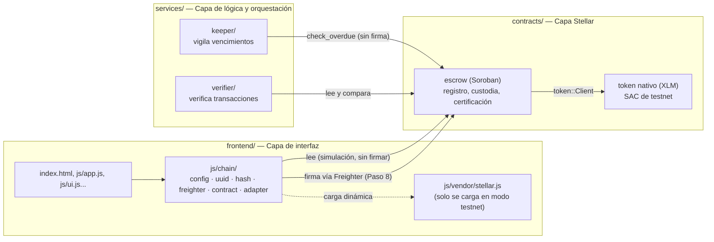

# Arquitectura on-chain · INN-LOCK

Cómo quedan conectadas las tres capas del [Blueprint](../Semana2/ProductBlueprint.md) (sección 7) ahora que `contracts/escrow` existe y el frontend puede leerlo (y, desde el Paso 8, firmarlo). Las secciones 1-3 cubren hasta el Paso 7 (estructura, adaptador y lectura). La sección 4 documenta el Paso 8: las 3 firmas de `register_project` (constructora, interventor, administrador) ya conectadas a las pantallas reales de la app, en modo demo + testnet.

## 1. Las tres capas



La interfaz nunca guarda llaves secretas: toda firma (Paso 8) pasa por la extensión Freighter, que vive en el navegador del usuario, no en este repositorio. `services/` todavía son carpetas con su rol documentado (ver sus `README.md`); el código llega después de este paso.

## 2. Función del contrato ↔ historia de usuario ↔ quién firma

| Función (`contracts/escrow`) | Historia de usuario | Quién firma |
|---|---|---|
| `register_project` | HU1 — la constructora define etapas y reglas de liberación | Constructora + Interventor + Administrador (las 3) |
| `deposit` | HU2/HU3 — el aporte de la compradora queda retenido | Administrador (la fiduciaria confirma que el pago llegó) |
| `report_milestone` | HU4 — la constructora reporta el avance con evidencia | Constructora |
| `observe_milestone` | HU4 — el interventor rechaza un reporte y pide corregirlo | Interventor |
| `certify_milestone` | HU3 + HU4 — el dinero se libera solo si el interventor certifica | Interventor |
| `claim_pending` | HU3 — cobra lo que quedó pendiente de una certificación parcial | Constructora |
| `check_overdue` | HU5 — alerta cuando una etapa vence sin certificar | **Nadie** (cualquiera puede llamarla; no cambia estado ni mueve dinero) |
| `freeze` / `unfreeze` | Protección del administrador ante un problema del proyecto | Administrador |
| `set_compliance` | Bloquea certificaciones si la constructora tiene documentos vencidos | Administrador |
| `request_schedule_change` | Cambios de cronograma (constructora) | Constructora |
| `resolve_schedule_change` | Aprobación/rechazo del cambio de cronograma | Interventor |
| `get_project`, `get_milestone`, `get_balance`, `get_contribution`, `get_report`, `get_compliance`, `get_certification`, `get_released_total`, `get_overdue`, `get_freeze`, `get_schedule_request` | "La compradora ve cuánto aportó, cuánto sigue retenido y qué evidencia justificó cada salida" (sección 4 del Blueprint) | **Nadie** (lectura pública, sin firma) |

## 3. Cómo correr cada modo

Ambos modos usan el mismo servidor: desde `frontend/`, `python -m http.server 4180` y abrir `http://localhost:4180`.

| Modo | Cómo se activa | Qué hace |
|---|---|---|
| **Simulado** (predeterminado) | Sin parámetros, o `?chain=simulado` | No toca la red. `js/chain/adapter.js` devuelve valores vacíos consistentes (igual de inofensivo que el modo `?demo=1` ya existente). No carga `js/vendor/stellar.js`. |
| **Testnet** | `?chain=testnet` (se recuerda en `localStorage`, se puede volver a `simulado` con `?chain=simulado`) | `js/chain/config.js` carga `js/vendor/stellar.js` de forma dinámica y `js/chain/contract.js` simula las consultas `get_*` contra el contrato real de `contracts/escrow/deployments/testnet.json`. Por ahora solo lectura: ver datos no requiere Freighter. Firmar (Paso 8) sí lo exigirá. |

El modo se guarda en el navegador, no en el servidor: cada persona que abre la página elige el suyo.

## 4. Paso 8 — Las 3 firmas de `register_project`, conectadas a la app real

Cuando el modo es testnet (`?chain=testnet`) **y** la sesión es de demostración (no `ctx.LIVE`/Supabase), `js/wizard.js` pide las 3 firmas en el momento natural del flujo existente — nadie tiene que ir a una pantalla aparte:

| Pantalla real | Quién firma | Si rechaza/observa |
|---|---|---|
| "Nuevo proyecto" → enviar/reenviar (`submit()`) | Constructora | — (siempre firma al enviar; si Freighter rechaza, el envío no se completa y puede reintentarlo) |
| "Solicitudes" → Aprobar cronograma (`solApprove`) | Interventor | Si observa (`solObserve`), **no se pide ninguna firma on-chain** |
| "Solicitudes" → Validar y activar (`solActivate`) | Administrador/fiduciaria (firma y envía) | Si no aprueba (`solObserve`), **no se pide firma on-chain** |

El puente entre esas pantallas y `js/chain/register.js` vive en `js/chain/demo-flujo.js` (`window.ChainDemo`). En modo simulado (el predeterminado) ese archivo no hace nada: la app se comporta exactamente igual que antes del Paso 8.

### Por qué los nonces coinciden en las 3 firmas

La invocación de `register_project` se simula **una sola vez**, en modo "recording" (la primera vez que alguien va a firmar, normalmente la constructora). Esa simulación es la que genera las 3 `SorobanAuthorizationEntry`, cada una con su nonce. A partir de ahí nunca se vuelve a simular: las 3 firmas se acumulan sobre ese mismo arreglo de entradas, guardado en `localStorage`; cada firmante solo rellena su propio puesto. Por eso el nonce es consistente sin que nadie tenga que coordinarlo a mano.

### Expiración de las firmas (días, no minutos)

No encontramos un tope duro documentado por el protocolo de Stellar para `signatureExpirationLedger` — solo la recomendación de "mantenla pequeña" por costo. Como un proyecto real puede esperar días entre que firma la constructora y revisa el interventor/administrador, la estrategia no es una ventana "infinita", sino:
- Ventana larga (7 días ≈ 120 960 ledgers) para constructora e interventor, que pueden esperar.
- Ventana corta (≈5 minutos) para el administrador, que firma y envía casi en el mismo instante.
- Si de todas formas se vence, `checkAuthEntryReadiness` lo detecta antes de dejar seguir, con un mensaje claro de quién debe volver a firmar (no hace falta reiniciar todo el proceso).

### Firmas atadas al hash del cronograma

Cada firma guardada queda atada al `hashCronograma` con el que se firmó. Antes de que el interventor o el administrador usen las entradas guardadas, `ChainDemo.verificarVigente()` recalcula el hash a partir de los datos **actuales** del proyecto y lo compara con el guardado:
- Si coincide, puede firmar normalmente.
- Si no coincide (el proyecto cambió de datos entre firmas — por ejemplo, fue editado y reenviado), se detiene con un mensaje claro y nadie firma sobre datos viejos. La próxima vez que la constructora reenvíe el proyecto, `prepararProyecto()` recalcula el hash: si cambió, descarta TODAS las firmas guardadas y hay que pedirlas de nuevo desde cero; si no cambió, las conserva (así una observación no obliga a repetir una firma que sigue siendo válida).

### Orden seguro: firmar antes, guardar después

En la activación (etapa del administrador), el orden es: firmar → enviar → esperar confirmación de la red → releer `get_project` y comparar contra lo firmado → **solo entonces** marcar el proyecto como activo en la base de datos de la demo. Si la cadena confirma pero ese último guardado falla, `js/wizard.js` (`activarConReintento`) ofrece un botón de reintento que primero comprueba que la cadena sigue confirmada (nunca vuelve a firmar ni a enviar) y solo repite el guardado.

### Interfaz: estado on-chain visible

En "Solicitudes" y en la ficha del proyecto (`js/wizard.js`, `chainInfoHtml`/`refrescarVigencia`) se ve, junto a lo que ya mostraba la demo:
- Una insignia "Firmado 1/3" → "2/3" → "Activo en cadena" (o "Error…"), calculada del estado guardado en `localStorage` — no necesita red para esto.
- Un enlace a Stellar Expert una vez que hay transacción enviada.
- La vigencia restante de cada firma ("vence en N ledgers (~M min)" o "firma caducada, debe firmar de nuevo"), que sí necesita una lectura de solo consulta (`ChainRegister.vigenciaFirmas`, un `getLatestLedger`) y por eso se completa después de pintar la vista, sin bloquear el render.
- Si la firma caducada es la del usuario que está mirando (constructora o interventor), un botón "Firmar de nuevo" que solo repite SU firma — no hace falta que nadie más vuelva a actuar.

### Prueba automatizada de punta a punta (sin Freighter)

`tools/e2e-testnet/` (fuera de `frontend/`, paquete propio) repite el mismo flujo de 3 firmas contra testnet real, pero sin Freighter: obtiene las llaves de `inn-constructora`/`inn-interventor`/`inn-admin` con la CLI de Stellar en el momento, firma cada rol con su propio `Keypair` en una llamada separada, el administrador firma último y envía, y al final relee `get_project` y compara. También corre los 5 casos negativos del Paso 8 (cuenta equivocada, cronograma modificado, firma caducada, registro doble, porcentajes que no suman 100%). Reutiliza `args.js`, `canonical.js`, `hash.js`, `uuid.js`, `errors.js` y `contract.js` del frontend tal cual, sin copiarlos. Ver `docs/semana3/GUIA_FIRMAS_TESTNET.md` para el comando y los requisitos.

### Firmar sin cambiar de cuenta en Freighter cada vez (`tools/test-signer/`, solo pruebas)

Freighter sigue siendo el único proveedor real: el frontend nunca maneja llaves secretas y toda firma de producción/demo normal pasa por la extensión, con la persona aprobando cada ventana a mano. Para no tener que cambiar de cuenta en Freighter en cada prueba manual de los 3 roles, `register.js` ahora recibe un **proveedor de firma** opcional (`js/chain/firmantes.js`, `window.ChainFirmantes`):

- **`proveedorFreighter()`** (el de siempre, se usa si no se pasa ninguno): exige estar en la cuenta correcta y abre las ventanas de Freighter.
- **`proveedorPruebaLocal()`**: delega la firma a `tools/test-signer/`, un servicio aparte en `127.0.0.1:4181` (paquete propio, fuera de `frontend/`) que firma con las llaves de `inn-constructora`/`inn-interventor`/`inn-admin` obtenidas de la CLI al arrancar. El resto del flujo —argumentos, hash canónico, verificación del hash antes de firmar, orden seguro, errores en español— es **idéntico** para los dos proveedores; solo cambia quién firma.

En el frontend, una casilla "🧪 Firmar con el servicio de pruebas" (visible solo en testnet) aparece junto a cada acción de firma (enviar proyecto, aprobar cronograma, activar proyecto, re-firmar una firma caducada). Mientras esté marcada y el servicio esté corriendo, esas acciones firman con `proveedorPruebaLocal()` en vez de pedir Freighter.

**Seguridad del servicio** (`tools/test-signer/server.js`):
- No arranca sin `INNLOCK_TEST_SIGNER=1`, sin confirmar que la red es exactamente testnet, y sin que las 3 identidades se llamen exactamente `inn-constructora`/`inn-interventor`/`inn-admin`.
- Escucha solo en `127.0.0.1:4181` y rechaza cualquier solicitud cuyo `Host` no sea `localhost:4181`/`127.0.0.1:4181` o cuyo `Origin` no sea `http://localhost:4180`/`http://127.0.0.1:4180` — probado contra un origen ajeno real (`https://viviendastellar.github.io`).
- **Nunca confía en lo que mande el frontend**: reconstruye la invocación a firmar desde el XDR real con el SDK y valida el contrato y la función contra una lista blanca (hoy solo `register_project` sobre el contrato escrow de `testnet.json`) — probado con contrato distinto, función distinta y XDR malformado.
- Las llaves se piden una sola vez con `stellar keys secret <nombre>` (confirmado con stellar-raven como el comando vigente en la CLI 28.1.0 instalada) y quedan solo en una variable en memoria del proceso del servicio; nunca se imprimen, registran, escriben a disco ni viajan en ninguna respuesta o error — probado con un escaneo de toda la salida del proceso buscando algo con forma de llave secreta.
- Antes de firmar, registra en consola un resumen legible (función, proyecto, hash) sin ninguna llave.

```bash
# Arrancar el servicio (deja la terminal abierta mientras pruebas):
cd tools/test-signer
INNLOCK_TEST_SIGNER=1 node server.js
```

Ver `docs/semana3/GUIA_FIRMAS_TESTNET.md` para el detalle completo (requisitos, cómo probar y pruebas del propio servicio).

### Límites conocidos de este piloto

- **Las 3 direcciones son cuentas de prueba compartidas** (`window.ChainConfig.testRoles`, creadas en el Paso 6), sin importar qué constructora/interventor reales estén asignados al proyecto en la demo. Cualquier constructora de la demo "firma" con la misma dirección de prueba. Esto se reemplaza por direcciones por usuario cuando llegue la migración de base de datos que les asigna una wallet propia — no antes de ese paso.
- **El presupuesto no tiene una conversión real a stroops/moneda**: se usa el número de pesos que captura el asistente directamente como unidades del token de prueba (`tokenContractId`). El token de testnet no representa dinero real, así que esta simplificación es aceptable solo para el piloto.
- Esto es exclusivamente para `?chain=testnet` en modo demostración; el modo real con Supabase (`ctx.LIVE`) no se toca — guardar el registro confirmado ahí es del Paso 11.
