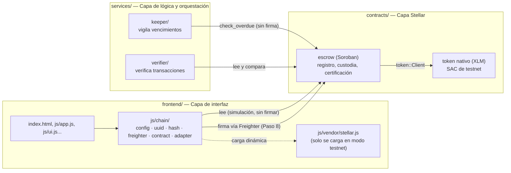

# Arquitectura on-chain · INN-LOCK

Cómo quedan conectadas las tres capas del [Blueprint](../Semana2/ProductBlueprint.md) (sección 7) ahora que `contracts/escrow` existe y el frontend puede leerlo. Este documento cubre hasta el Paso 7: estructura, adaptador y **lectura** desde testnet. Firmar y enviar transacciones (con Freighter) es el Paso 8.

## 1. Las tres capas

La interfaz nunca guarda llaves secretas: toda firma (Paso 8) pasa por la extensión Freighter, que vive en el navegador del usuario, no en este repositorio. `services/` todavía son carpetas con su rol documentado (ver sus `README.md`); el código llega después de este paso.

## 2. Función del contrato ↔ historia de usuario ↔ quién firma

| Función (`contracts/escrow`) | Historia de usuario | Quién firma |
|---|---|---|
| `register_project` | HU1 — la constructora define etapas y reglas de liberación | Constructora + Interventor + Administrador (las 3) |
| `deposit` | HU2/HU3 — el aporte de la compradora queda retenido | Administrador (la fiduciaria confirma que el pago llegó) |
| `report_milestone` | HU4 — la constructora reporta el avance con evidencia | Constructora |
| `observe_milestone` | HU4 — el interventor rechaza un reporte y pide corregirlo | Interventor |
| `certify_milestone` | HU3 + HU4 — el dinero se libera solo si el interventor certifica | Interventor |
| `claim_pending` | HU3 — cobra lo que quedó pendiente de una certificación parcial | Constructora |
| `check_overdue` | HU5 — alerta cuando una etapa vence sin certificar | **Nadie** (cualquiera puede llamarla; no cambia estado ni mueve dinero) |
| `freeze` / `unfreeze` | Protección del administrador ante un problema del proyecto | Administrador |
| `set_compliance` | Bloquea certificaciones si la constructora tiene documentos vencidos | Administrador |
| `request_schedule_change` | Cambios de cronograma (constructora) | Constructora |
| `resolve_schedule_change` | Aprobación/rechazo del cambio de cronograma | Interventor |
| `get_project`, `get_milestone`, `get_balance`, `get_contribution`, `get_report`, `get_compliance`, `get_certification`, `get_released_total`, `get_overdue`, `get_freeze`, `get_schedule_request` | "La compradora ve cuánto aportó, cuánto sigue retenido y qué evidencia justificó cada salida" (sección 4 del Blueprint) | **Nadie** (lectura pública, sin firma) |

## 3. Cómo correr cada modo

Ambos modos usan el mismo servidor: desde `frontend/`, `python -m http.server 4180` y abrir `http://localhost:4180`.

| Modo | Cómo se activa | Qué hace |
|---|---|---|
| **Simulado** (predeterminado) | Sin parámetros, o `?chain=simulado` | No toca la red. `js/chain/adapter.js` devuelve valores vacíos consistentes (igual de inofensivo que el modo `?demo=1` ya existente). No carga `js/vendor/stellar.js`. |
| **Testnet** | `?chain=testnet` (se recuerda en `localStorage`, se puede volver a `simulado` con `?chain=simulado`) | `js/chain/config.js` carga `js/vendor/stellar.js` de forma dinámica y `js/chain/contract.js` simula las consultas `get_*` contra el contrato real de `contracts/escrow/deployments/testnet.json`. Por ahora solo lectura: ver datos no requiere Freighter. Firmar (Paso 8) sí lo exigirá. |

El modo se guarda en el navegador, no en el servidor: cada persona que abre la página elige el suyo.
