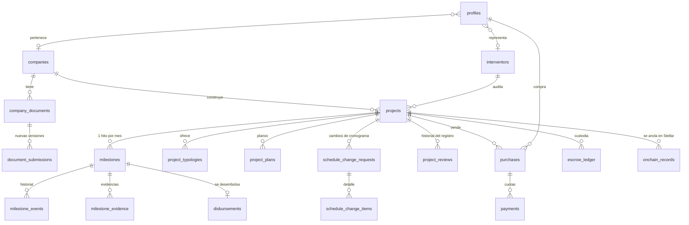

# INN-LOCK · Base de datos (Supabase / PostgreSQL)

> En el repositorio del equipo esta carpeta vive en `frontend/supabase/` (la integración de Supabase con GitHub usa la ruta `frontend`).

Modelo de datos, seguridad y flujo de negocio de la plataforma de custodia de fondos para vivienda sobre planos.
La capa on-chain (Stellar/Soroban) se anclará después; hoy `onchain_records` guarda lo que se anclará con `status = 'simulado'`.

## Contenido

```
supabase/
├─ config.toml                      Configuración de la CLI (local)
├─ migrations/
│  ├─ …001_tipos_y_tablas_base      Tipos, perfiles, constructoras, interventores, catálogos y documentos legales
│  ├─ …002_proyectos_hitos_y_finanzas  Proyectos, cronograma por hitos, evidencias, cambios, fondos, compras, auditoría
│  ├─ …003_funciones_triggers_y_vistas  Helpers, triggers de protección, vistas y todo el flujo de negocio (RPC)
│  ├─ …004_seguridad_rls            Privilegios, RLS y políticas
│  ├─ …005_almacenamiento           Buckets y políticas de Storage
│  ├─ …006_catalogos                Fases de obra y tipos de documento
│  └─ …007_admin_correo_y_organizaciones  Correo en perfiles y gestión de constructoras, interventores y usuarios
├─ seed.sql                         Datos de demostración (solo local)
└─ tests/
   ├─ validate.mjs                  76 pruebas de migraciones, RLS y flujo completo (sin Docker)
   └─ e2e/                          La página real en modo «en vivo» contra la misma base simulada (ver abajo)
```

## Cómo usarlo

**Probar sin instalar nada (Postgres en memoria):**
```bash
cd supabase/tests && npm install && npm test
```

**Local con Supabase CLI** (requiere Docker): `supabase start` aplica migraciones y `seed.sql`; `supabase db reset` lo reinicia.

**En tu proyecto de Supabase (nube):**
1. Crea el proyecto en https://supabase.com/dashboard.
2. `supabase link --project-ref <ref>` y `supabase db push` (aplica solo las migraciones, **no** el seed).
3. En *Authentication → Providers* deja habilitado el correo. Los usuarios nuevos nacen como **comprador**.
4. Crea tu primer administrador: regístrate y, en el *SQL Editor*, ejecuta (una sola vez):
   `update public.profiles set role = 'admin' where id = '<tu-uuid>';`
   Desde ahí, los demás roles se asignan con `select admin_set_role(...)`.

> `seed.sql` crea usuarios con contraseña `demo1234`. **No lo ejecutes en producción.**

## Diagrama



## Flujo de negocio (todo por funciones RPC; el cliente no cambia estados)

| # | Quién | Función | Resultado |
|---|---|---|---|
| 1 | Constructora | `save_project(id, payload, submit)` | Crea/edita el proyecto, tipologías, planos y **cronograma** de una sola vez. Con `submit = true` valida y lo envía |
| 2 | Interventor asignado | `review_project(id, aprobar, nota)` | `interventor → admin` (o `observado` con motivo) |
| 3 | Administrador | `activate_project(id, aprobar, nota)` | `admin → activo`: **bloquea el cronograma**, abre el mes 1 y registra el ancla del cronograma |
| 4 | Constructora | `submit_milestone(hito, resumen, avance)` | Exige ≥ 3 fotos; pasa a `revision` |
| 5 | Interventor | `review_milestone(hito, aprobar, nota, checks)` | Aprobar exige 4 verificaciones y que la constructora **no tenga documentos vencidos**; crea desembolso, asiento en la custodia, registro on-chain y abre el siguiente mes |
| 6 | Constructora | `request_schedule_change(proyecto, motivo, items)` | Solo meses pendientes; el total se conserva |
| 7 | Interventor | `resolve_schedule_change(solicitud, aprobar, nota)` | Aplica cambios, recalcula el acumulado y re-ancla |
| 8 | Constructora / Admin | `submit_document(...)` / `review_document_submission(...)` | Renovación de Cámara, RUT, póliza… con validación del administrador |
| 9 | Admin | `admin_set_role`, `create_purchase`, `mark_payment_paid` | Roles, ventas y confirmación de pagos (cada pago ingresa a la custodia) |

Estados del proyecto: `borrador → interventor → admin → activo → finalizado` (con `observado` como retorno).
Estados del hito: `pendiente → en_curso → revision → desembolsado` (con `observado` como retorno).

### Reglas del cronograma (`validate_schedule`)
Entre 6 y 60 meses · suma exactamente 100 % · fases en orden · tope por hito `max(15 %, 200 / meses)` · al menos una actividad por mes.

## Seguridad

| Rol | Ve | Escribe directamente |
|---|---|---|
| **anon** | nada | nada |
| **comprador** | proyectos activos, **sus** compras/pagos/aportes, y evidencias y desembolsos de su proyecto | su nombre, teléfono y cargo |
| **constructora** | sus proyectos (todas las etapas), documentos de su empresa, sus hitos | borradores propios y evidencias de hitos abiertos |
| **interventor** | proyectos asignados (desde que se envían), sus revisiones, auditoría de su proyecto | nada (solo RPC) |
| **administrador** | todo | nada directo: usa RPC (queda en auditoría) |

Garantías reforzadas con triggers (además de RLS y privilegios por columna):
- Nadie puede cambiarse el rol, la organización o el estado (`guard_profile_update`); el alta siempre crea un **comprador**.
- El estado del proyecto y los hitos solo cambian por RPC; un cronograma **bloqueado** no se modifica ni con acceso directo (`guard_*`).
- Las funciones internas (`log_audit`, `notify`, `_submit_project`…) no son invocables por el cliente.
- Las rutas de evidencia deben pertenecer a su hito (`{project_id}/{milestone_id}/…`).

## Storage

| Bucket | Acceso | Ruta |
|---|---|---|
| `project-photos` | lectura pública | `{company_id}/archivo` |
| `project-plans` | admin, la constructora y el interventor asignado | `{company_id}/{project_id}/archivo` |
| `company-documents` | ídem | `{company_id}/archivo` |
| `milestone-evidence` | participantes del proyecto y compradores del mismo | `{project_id}/{milestone_id}/archivo` |

## Vistas útiles para el front-end

- `v_company_documents` — documentos con `effective_status` (`vigente | por_vencer | vencido | revision | faltante`).
- `v_milestones` — hitos con `amount` y nombre de fase.
- `v_project_funds` — `budget`, `released`, `in_review`, `custody`, `contributed`, `escrow_balance` (solo de proyectos visibles).
- `v_purchases` — compras con cuotas pagadas, total pagado y próxima cuota.
- `company_compliance(company_id)` — `ok, total, pct, blocked`.

## Ejemplo con supabase-js

```js
const { data: projects } = await supabase.from('projects').select('*, project_typologies(*), milestones(*)');
const { data: id }       = await supabase.rpc('save_project', { p_id: null, p_payload: payload, p_submit: true });
await supabase.rpc('review_milestone', { p_milestone, p_approve: true, p_note: 'OK', p_checks: [true, true, true, true] });
supabase.channel('hitos').on('postgres_changes', { event: '*', schema: 'public', table: 'milestones' }, refrescar).subscribe();
```

## Conexión con la página (modo real)

La página (`js/config.js`) usa la URL del proyecto y la clave **publishable**; la seguridad la dan las políticas RLS, no el secreto de la clave.
Nunca pongas la `service_role` ni la contraseña de la base en el front-end.

**Configura la autenticación en Supabase** (*Authentication → URL Configuration*), o los correos de confirmación apuntarán a localhost:
- **Site URL:** `https://viviendastellar.github.io/Proyecto_Vivienda_Stellar/INN-LOCK-Web/`
- **Redirect URLs:** la misma dirección (y `http://localhost:4180` para pruebas locales).
- *Authentication → Providers → Email:* decide si exiges confirmar el correo (recomendado en producción).

**Modo demostración:** `?demo=1` o el enlace «Ver la demostración» en el inicio de sesión usan datos de ejemplo guardados en el navegador, sin tocar la base.

**Prueba de integración sin tocar tu proyecto** (la página real contra una base simulada con las migraciones y el seed):
```bash
cd supabase/tests && npm install      # una sola vez
cd ../.. && python -m http.server 4180
# abre http://localhost:4180/supabase/tests/e2e/ y en la consola del navegador:  await runScenario()
```

## Decisiones y pendientes

- El **interventor** lo elige la constructora al registrar el proyecto; el administrador lo valida al activar. Si prefieres que lo asigne la plataforma, se cambia `save_project` (un campo).
- Los hashes, firmas y `onchain_records` son **simulados** hasta integrar Soroban; el contrato podrá consumir `onchain_records` y confirmar con `status = 'confirmada'` desde una función de servicio (`service_role`).
- La pasarela de pagos de compradores no está modelada: `mark_payment_paid` la reemplaza hasta integrarla.
- Notificaciones por correo: la tabla `notifications` ya existe; falta un *Database Webhook* / Edge Function para enviarlas.
